> Idea generation is just a first part, **idea execution** is necessary.

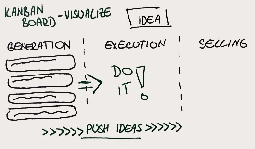

***

> Act → experiment → fail → adapt → learn (repeat).

***

> 4 areas of managing your life
> 1. Rock-solid routine
> 2. Find focus
> 3. Tame your tools
> 4. Sharpen creative mind

***

> Don’t live at the mercy of the surroundings – create barrier.

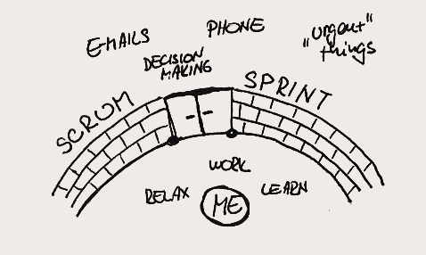

***

> Biggest issue are the small things – everyday stuff is most overwhelming.

Daily hygiene, preparing food, commute to work, random chats, sorting e-mails, paying bills, cleaning up workspace, headaches, distractions, going to toilet, or even choosing what music to listen. Try to optimise this first.

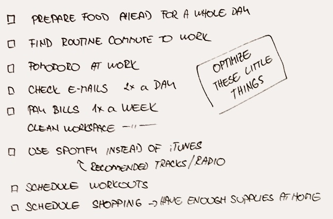

***

> Ecosystem for creativity: allowed errors, focus, immediate feedback

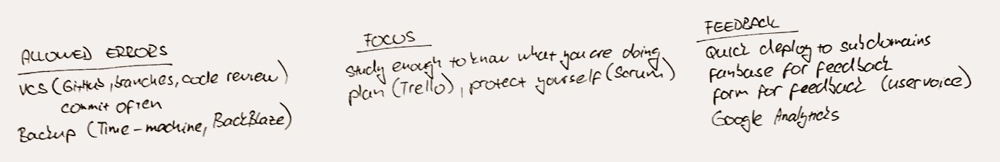

***

> Rethink work – pause, step back and think how you do things. Have meetings how your team works.

Do weekly retrospective at work.
Do weekly personal retrospective at work.
Rethink your habits every month.
Rethink your goals every month.

***

> Do mostly proactive work, try to avoid reactive work or postpone it.
Scrum sprint and scrum master should protect me before rash changes.

***

> Do not be always accessible.
Check e-mail twice a day, turn on Do not disturb during work, turn off Facebook chat.

***

> 80 percent of success is showing up.
Regular attendance at work, gym, school, meetings is part of success.

***

> Prepare trigger moments. Figure how to deal with your demons.

**Physically tired** → motivation posters / video.
**Psychically tired** → quiet 10-min nap
**Overwhelmed** → clean room, clean yourself.
**Lost focus** → play guitar.

***

> Be prepared for creativity/opportunity to come.
Have blog prepared. Know your tools. Be healthy and physically strong.

***

> World demands and your ambitions are in conflict.

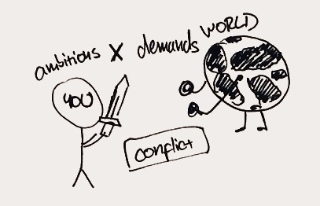

***

> Do not spent best time of day on other people priorities.
> Get some work done before office sturt to buzzing.
> Creative work first, reactive after.
> Start with difficult stuff.
Things to do first: write, cook, work.
Things to do later: e-mail, Facebook, twitter, reading, administrative.

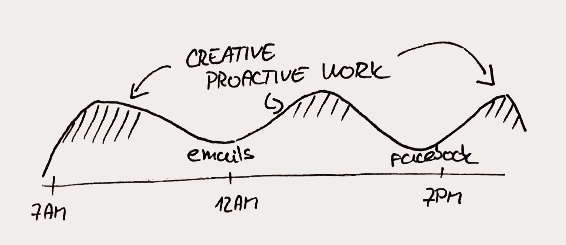

***

> Capture every commitment and free your mind from it.
Write it down (paper, Things, Wunderlist), deal with it later in batch.

***

> Do not wait for creative moods
Do it and creative mood will come –or not, but do it anyway.

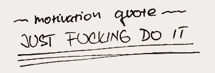

> Habit of frequency is more stronger than short-term extra strong effort or talent.
> Frequency makes starting easier.
> Hard to reenter project after break. Keep momentum going. Easier to pickup where you left.
Apply to flossing, playing guitar, drawing, waking up early.

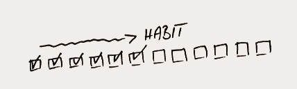

***

> Seeing progress is reassuring. Day by day, we build our lives.
> We like to feel we are making progress. Sense of progress in creative work is harder to measure.
Remind yourself of effort.

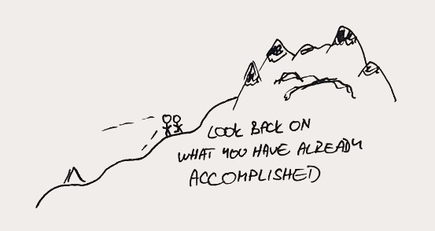

***

> Selling it is part of everything.

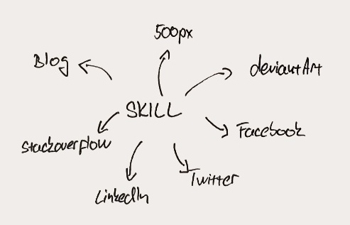

***

> Live in sync with your body natural rhythm.

45 min block focus intervals, enough sleep, changing intensity of work, healthy body.

***

> Have some time for solitude.
> Practise simple meditation - you don’t have to discover meaning of life, just don’t do anything for a while.

***

> Avoid distractions - even distraction of choice.

***

> Value lost by distractions is hard to measure.
> Distractions – sometimes helpful, but **always disrupt**.
> Have daily focus blocks without ANY distractions.

***

> Temptation for drift of focus is big. But resisting takes a lot of effort and mental energy.
> It takes energy to resist - it becomes harder and harder during a day.

Try to remove temptations entirely, even from background.

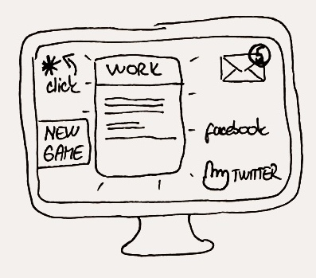

***

> Human mind can multitask only in highly automated activities.
Do not try to multitask at work or creative activities.

***

> Our brain have its own agenda. Do not count on him.

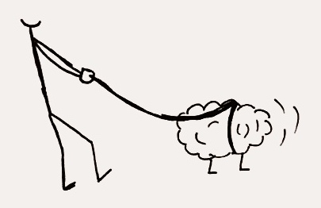

***

> Unfinished project is like a mental itch, work by checkpoints, don’t stop until reaching some kind of finished stated.

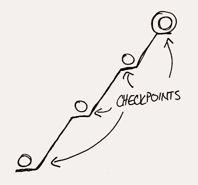

***

> Every time you are doing something, you are not doing something else.

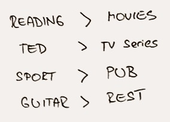

***

> Guilt as motivation works, but just short term.

***

> Waiting for everything to be perfect is just justifying of procrastination.

Ship early, ship often!

***

> Tame your tools – we are overwhelmed with them, but also addicted to them.

***

> It’s easy to blame tools, but it us.

***

If new idea is asking for your focus, think wheter pursuing it will help you achieve your complex goals.

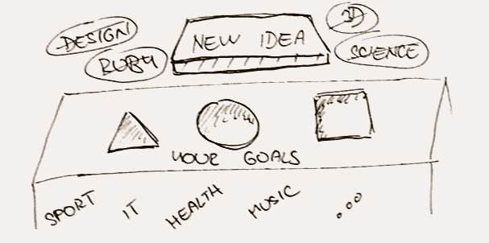

***

> Learn to say **no** to almost everything.

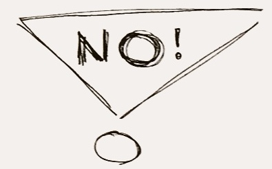

***

> Social media fullfil our fundamental need – belonging, sense that we matter.

It’s easy to get lost in them.

***

> Mindless-ness is our default state.

We have to put energy into making us mindful beings.

***

> Followers, likes, friends, engagement, traffic – easy to obsess with these, but they are not necessary for fulfilment.

Make things that matters – to you.

***

> You can do anything, but not everything.

***

> Know when to turn technology off – get mind in different mode.

Reserve moments in your life without technology.

***

> If you follow somebody on social network, you are letting him inside your brain.

***

> Learn to filter – we are already filtering lot of information in real world, learn this in digital world too.

***

> Healthy digital life.

Consciousness computing. Good breathing. Screen apnia.

***

> We have welcomed technology too lovingly into our lives.

***

> There is difference between urgent and important.

If you choose urgent over important, you are choosing easier over harder, other people priorities over yours.

***

> Find time to think, reflect and imagine.
[#solitary]

***

Getting lost while driving was part of adventure. We have lost this by using GPS.

***

Do not seek for approval of followers.

***

Keep our goals at sight to consider them while planning.

***

Create routine by breaking out of routine.

***

> Mute your inner critic. Mute perfectionist tendencies.

[#creativity]

***

> Unnecessary create to exercise mind.

[#creativity]

***

> Keep a list of your personal projects to do in spare time.

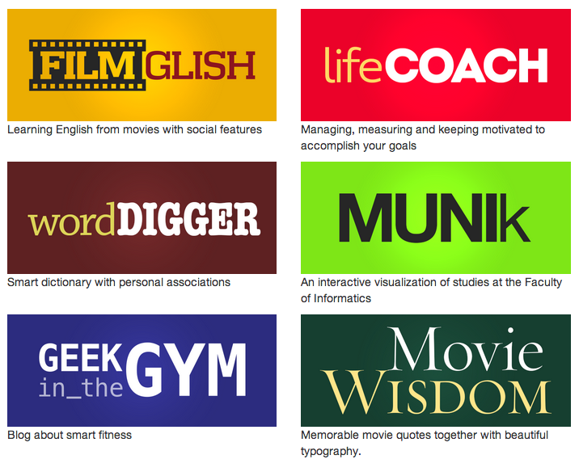

***

> You are paid to deliver predictive results – bad for creativity.

Have exploratory side projects.

***

> Find time for play, relaxation and exploration.

***

> Ritual of morning creativity.

***

> There’s gap between what we do and what we feel we are capadle of doing.

***

> Don't let your day-to-day work be only activity you engage in.

***

> Be true to yourself.

***

> Wander, physically and mentally.

***

> Restrictions put mind in problem-solving mode.

***

Physical exercise sharpens brain activity.

***

