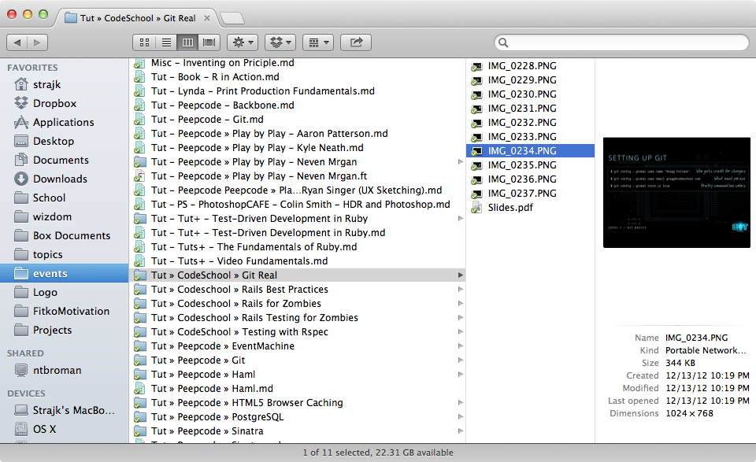

### Problem

Being a polyglot geek (#TODO: be more modest), I'm constantly watching a lot of talks, screencasts and tutorials (eg. [Railscasts](http://railscasts.com/), [Peepcode](https://peepcode.com/), [Tuts+](https://tutsplus.com/) and many others) and reading a lot of IT books and articles. Problem is, how to keep track of them and how to effectively (and comfortably at the same time) take notes.

  


### Not so good solutions

* <strong>Plain markdown</strong> – not enough, cannot attach images, source code, video etc.

* <strong>Evernote</strong> – very proprietary format, not so happy with Evernote UI and particularly complicated note formating

  


### Not so good solution, but so far the best

Combination of <strong>one main markdown document</strong> + optionally <strong>one attached directory</strong> with assets: screenshots, source files, slides, …

  


  


  


### My screencasts workflow

I watch screencasts on iPad (via [AirVideo app](http://www.[inmethod.com/air-video/](http://inmethod.com/air-video/))), so I can pay full attention (I cannot achieve when watching on Macbook with so much distractions) and make screenshots of interesting stuff. Later (within one week) I import images to Macbook and write some notes in markdown.

  


### Improving

I prepared simple shell script to quickly initialize & open markdown document and folder of desired name

  


``` bash

#!/bin/sh

  


input=$1

  


echo "Preparing structure for taking notes: $input"

  


# Change directory

cd /Users/strajk/Dropbox/Notes/app/views/events

# Create and open notes file

file="$input.md"

if [[ ! -f $file ]]; then

  touch $file

fi

open -a '/Applications/FoldingText.app' $file

# Create directory

mkdir $input

# Open finder

open -a Finder $input

```

  


You can use 29cb2448018800ab to run it quickly

  


  

