A Deep Dive Into JavaScript Modules  

  

[http://toshsharma.github.io/presentation-js-modules/](http://toshsharma.github.io/presentation-js-modules/)  

  

Problem: maintain correct order of <script> tag 

  

polluted global → encapsulation

  

CommonJS – server side

AMD modules – in-browser

  

#### CommonJS Modules 

CommonJS – Standardizing JS API, Write once, run everywhere (web, cli, desktop)  

* exports

* require()

* One module per file

* Top-level or relative module IDs   

  

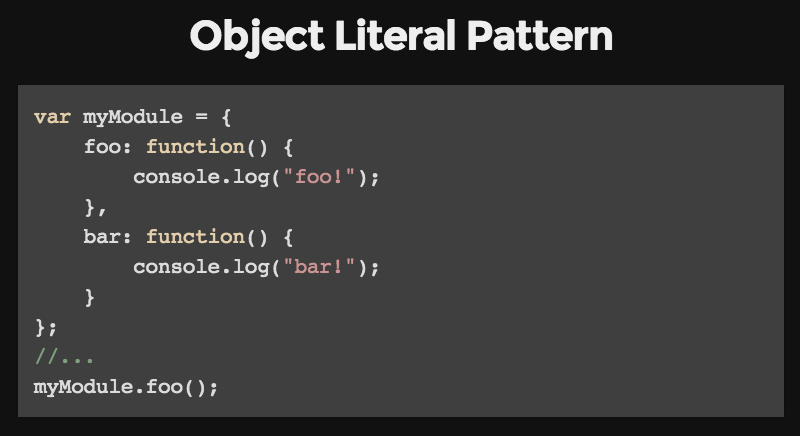  

  

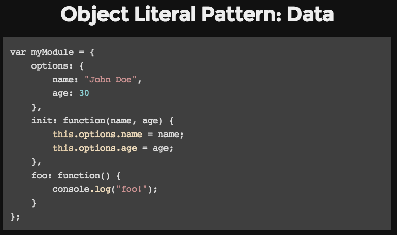  

  

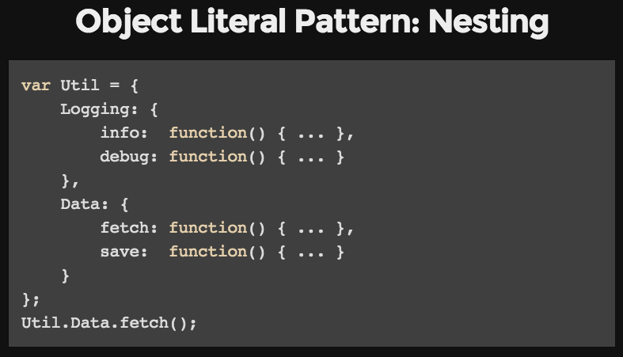  

  

  

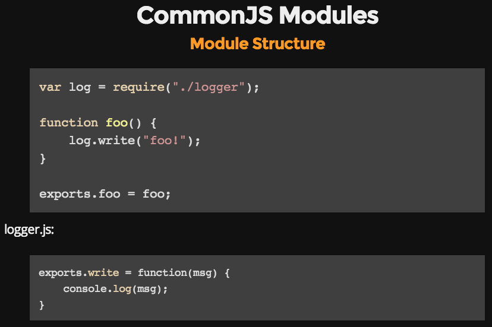  

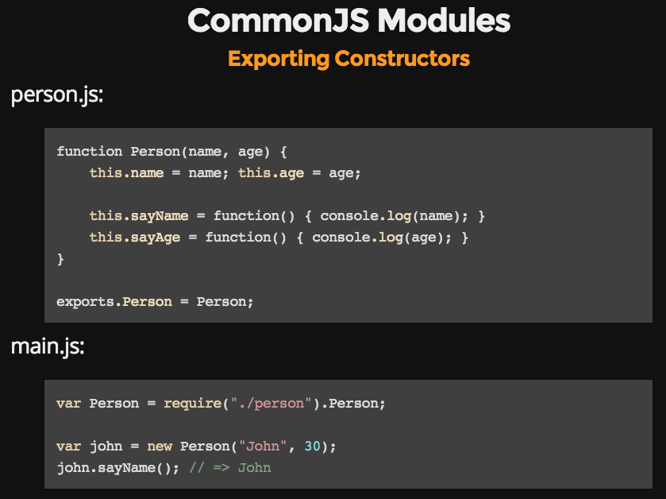  

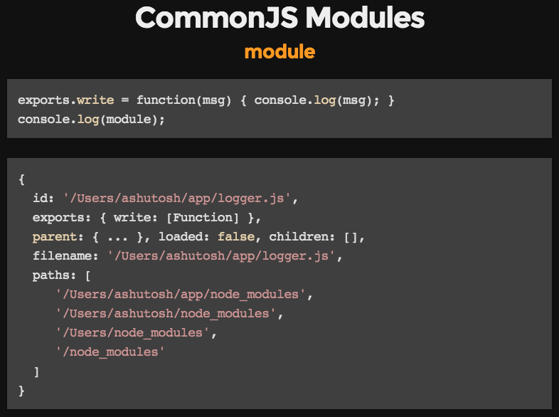  

  

* * *

  

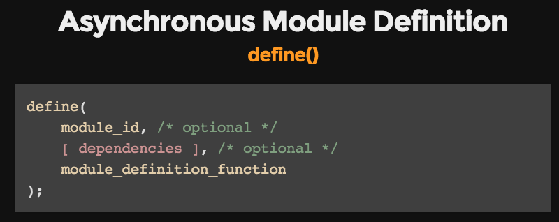  

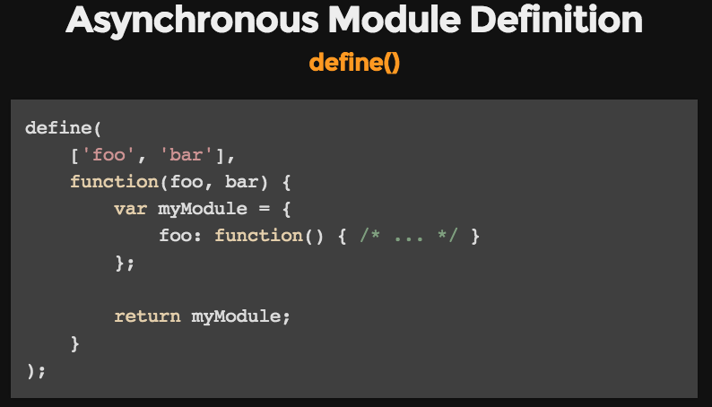  

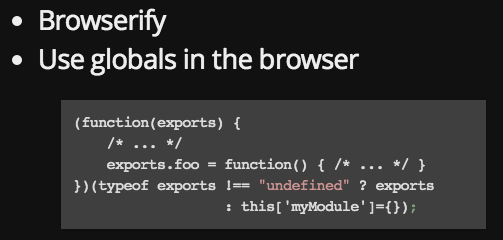  

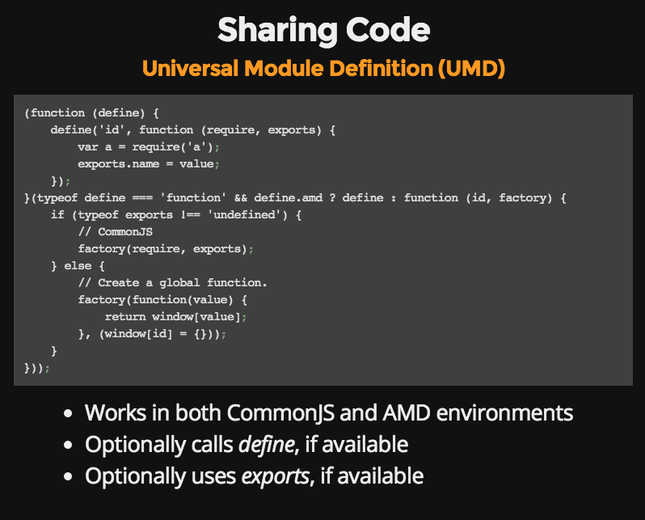  

  

  

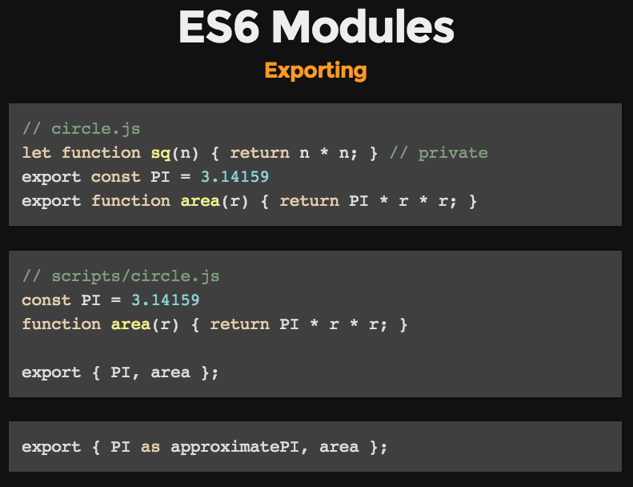  

