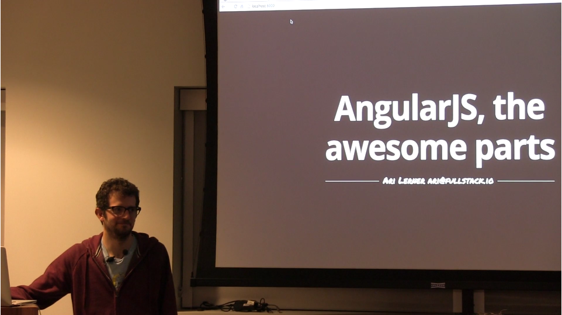
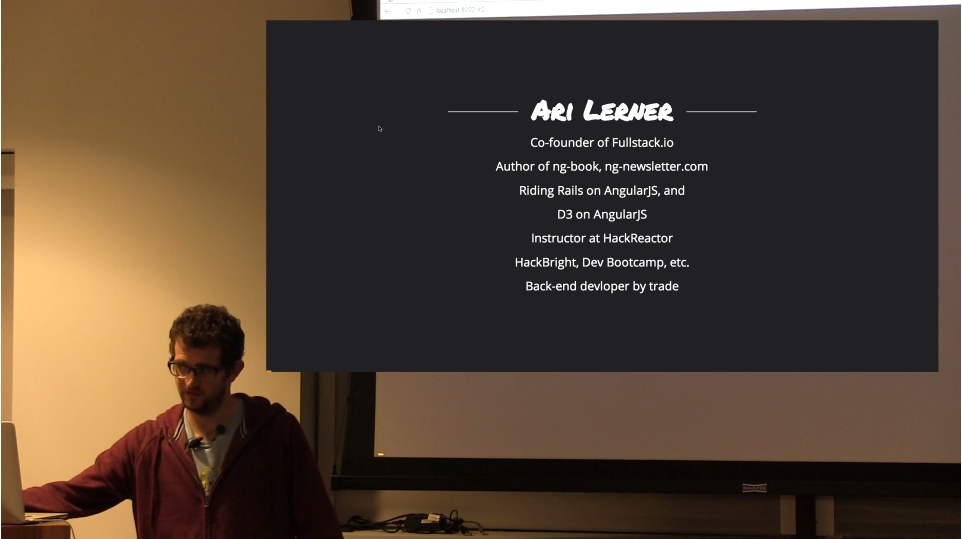
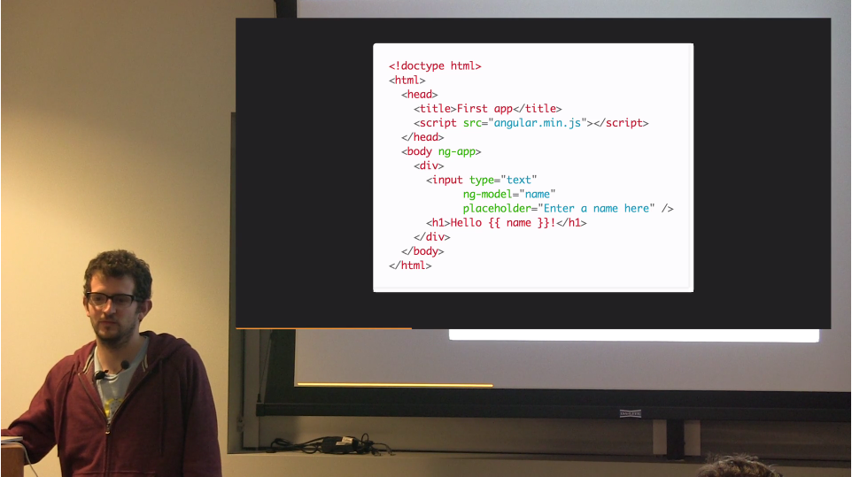
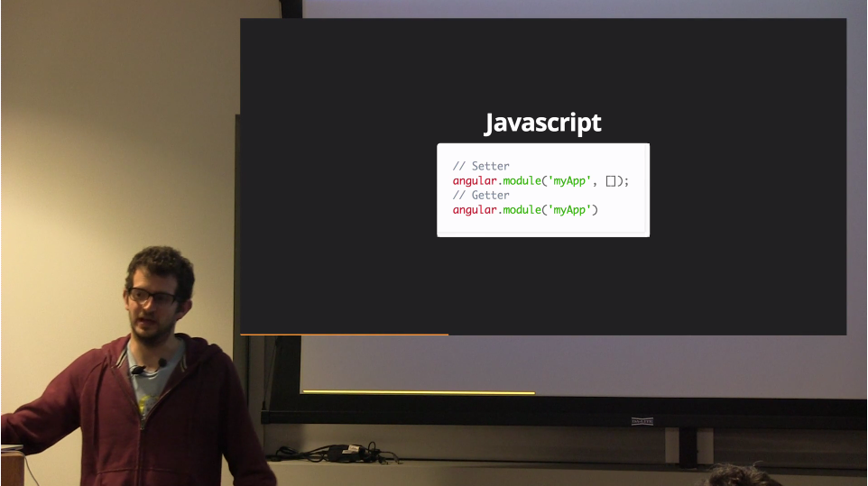
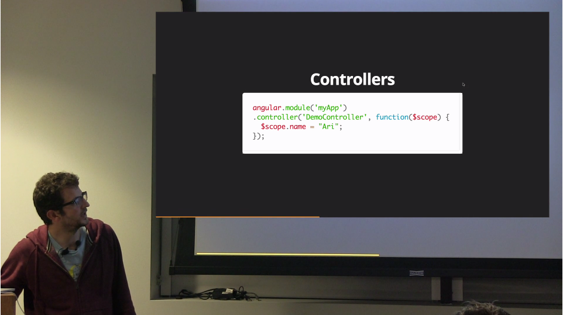
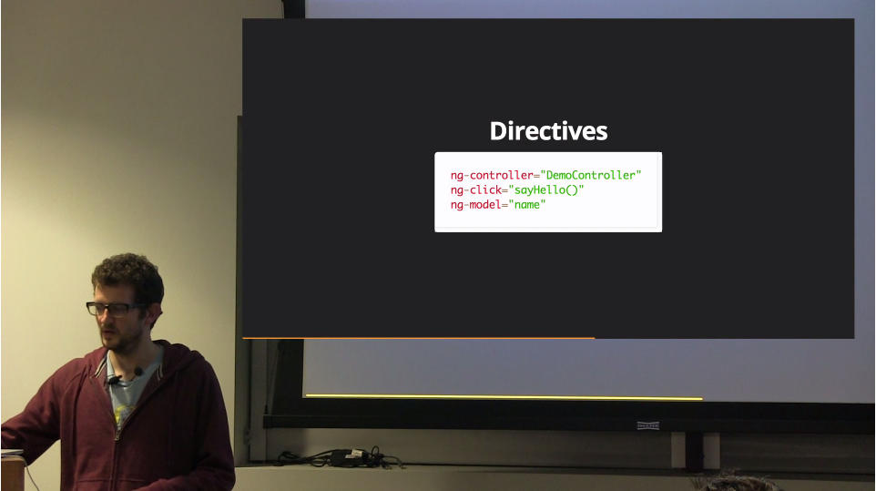

# AngularJS: The Awesome Parts on Vimeo
https://vimeo.com/90388983

Ari Lerner
@auser

HTML is old – static, wasn’t built for web apps. We use Javascript for interaction.

JQuery is wrapper on DOM. But for webapps is not so great – tight coupling, don’t enforce code structure, low-level.

Reinvent HTML for web-apps – Angular.

Internal apps and all over the internet

<https://livelovely.com>
<http://kangaroom.net/>
<https://madebysource.com/>

Cost-efficient – super fast to make impressive apps.

> If you are not testing, you should be ashamed. If you are not testing one year from now, you wouldn’t have a job.

Active community.
<https://www.ng-book.com/>
<http://www.reddit.com/r/angularjs/>
<http://angularjs.meetup.com/>
<https://geekli.st/community/angularjs>

First Angular app.

Data-binding, get hold of data by $scope. $scope is POJO.

Views are simply HTML. Binding by `{{ }}`

Directive is a function that is called on a DOM element to augment it’s functionality.

ng-repeat – iterating
ng-init
ng-view
ng-class
ng-if
… + own directives

Build in services: $scope, $q, $http, …

Populating, showing and manipulating data – core interest of web app.
