# Application Building Patterns with AngularJS
<http://pluralsight.com/training/Courses/TableOfContents/show-me-angular>

  

Project: rebuild Mongo Explorer, originally written in Backbone.

Angular-way – you need to learn to think in angular way

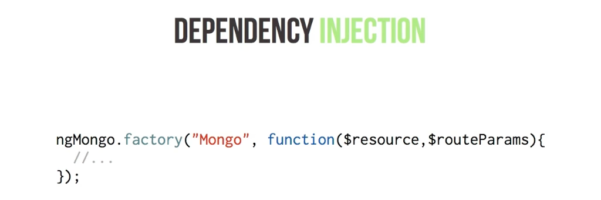  

Common with Express on NodeJS backend.

Two-way data-binding, most known from Knockout.

Templating similar to Handlebars.

Controllers – no special inheritance, no prototype inheritance, just plain functions.

Templating is happening directly in DOM

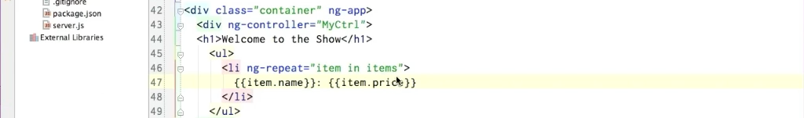  

Very easy UNIX style filters. `|`

  

### Directives

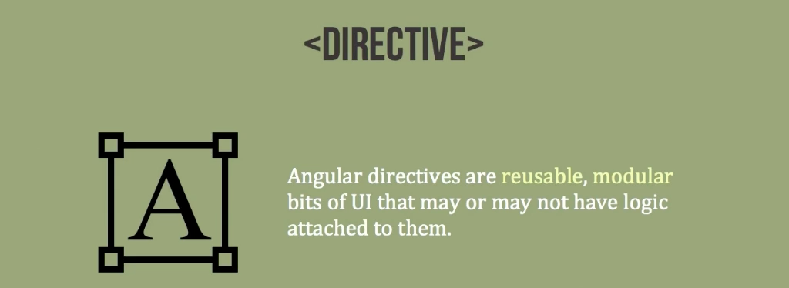  

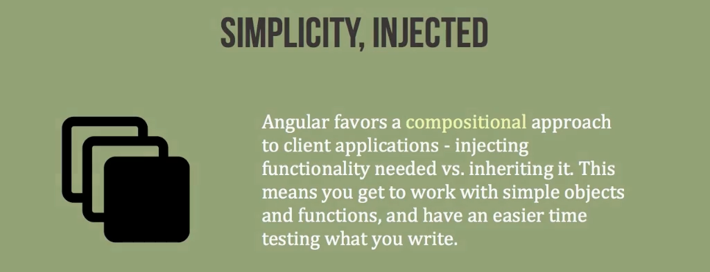  

Modules – organise, orchestrate start, configure.

Angular doesn’t have one entry point – main function.

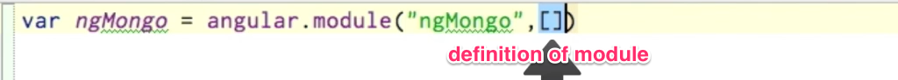  

factory → object

service → function

Services are singletons.

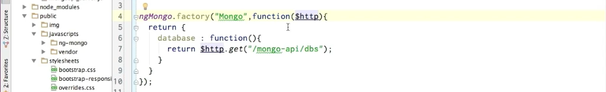  

You don’t have what you don’t have asked for.

$resource – elegant, simple solution for data accessible restful API.

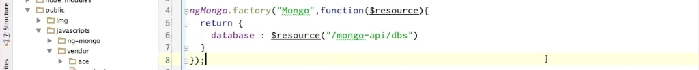  

```

$resource(“”).get → GET

$resource(“”).query → GET

$resource(“”).save → POST

$resource(“”).delete → DELETE

$resource(“”).remove → REMOVE

```

Creating new resource is magically easy.  

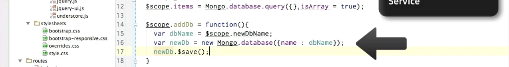  

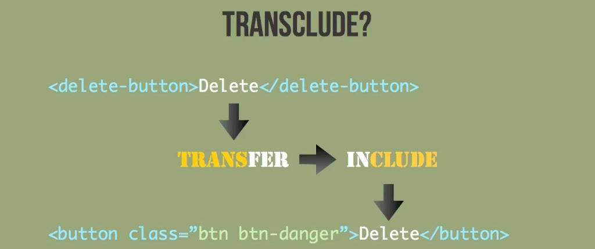  

Templates are handled as DOM elements, not gigantic strings.

Directive should not be bind to one controller, it should be reusable.

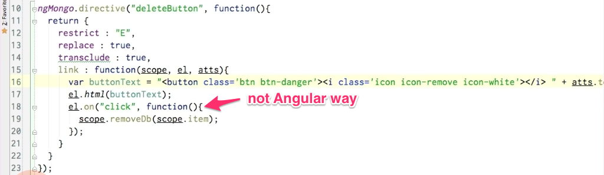  

It possible to do everything in linking function through jQuery, but it’s not Angular way.

  

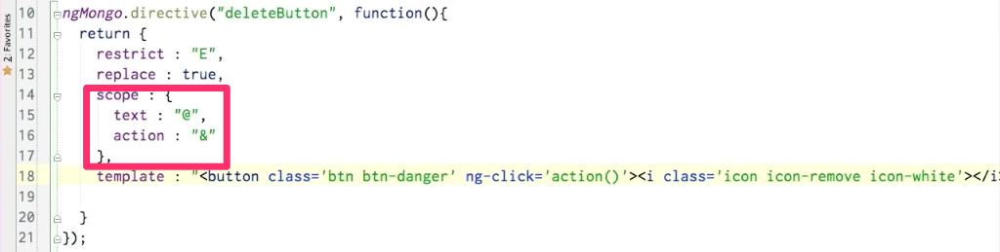  

Create namespaces for easier maintainability – your company as prefix.

  

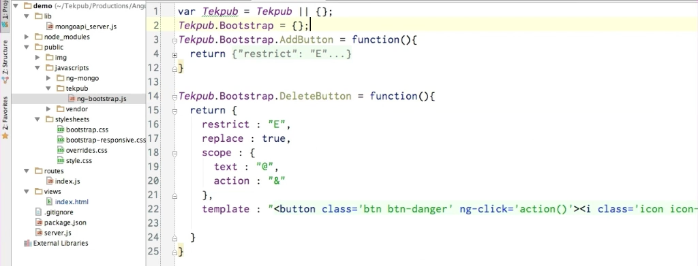  

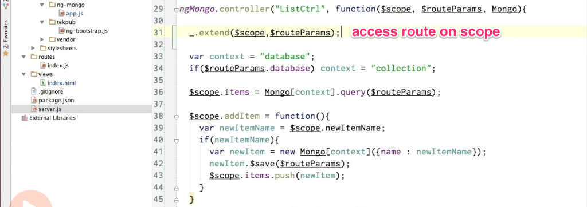  

`ng-anything` – without {{ }}, everywhere else – with {{ }}

  

 Directive controllers share their scope with child directives.

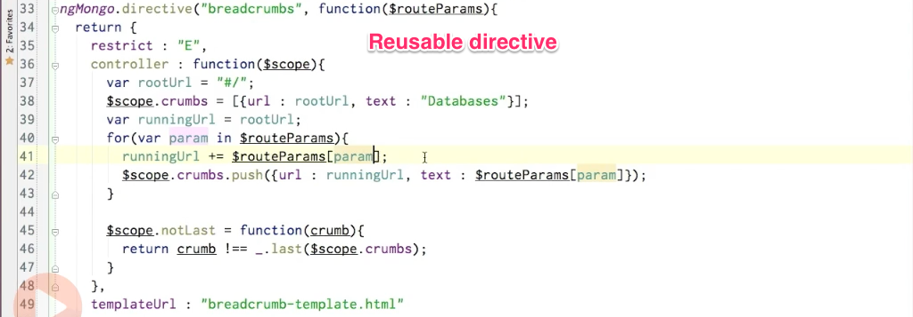  

Reduce technical dept after each big change ( = refactor).

### Routing

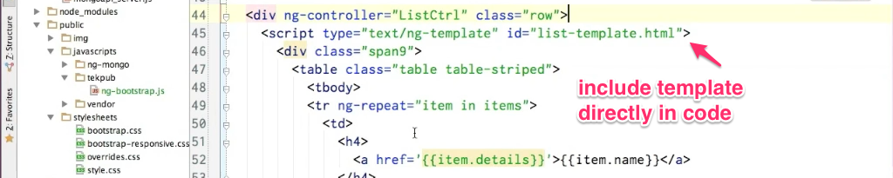  

### Refactoring

Services are lazy-loaded, when they are injected for the first time.

Factories are using revealing module pattern – more ceremonial, but explicate.

Factories are good when you have a lot of behind the scenes code, then set what is public.

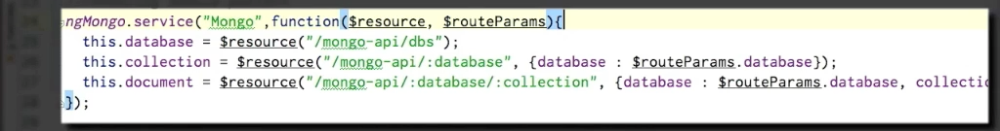  

Do not expect services to change, they are singletons.

For more configuration, use `provider`

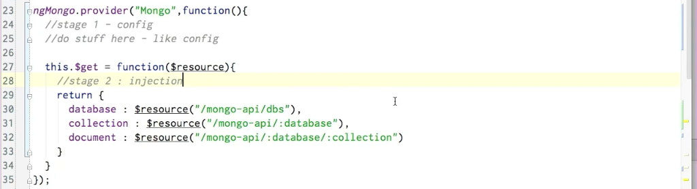  

Constants can be injected into configurations. Values too, but values can be changed, constants not.  

Manual bootstrap

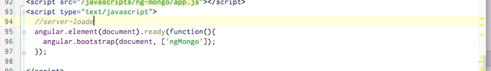  

Process data before sending them to API.
