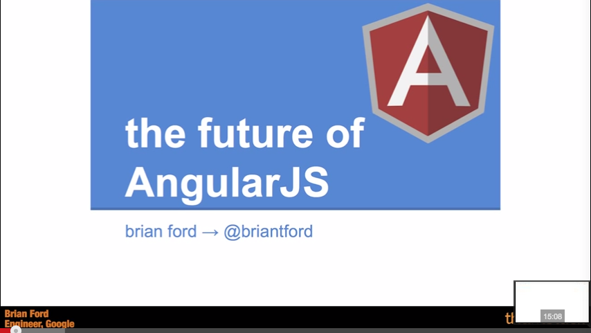
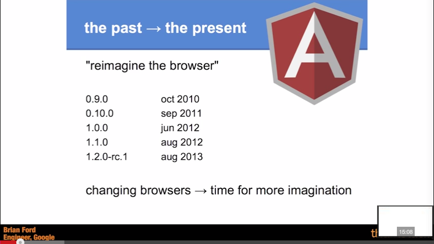
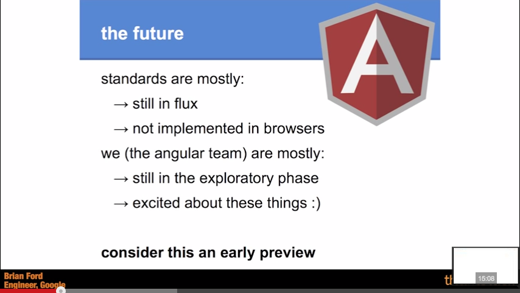
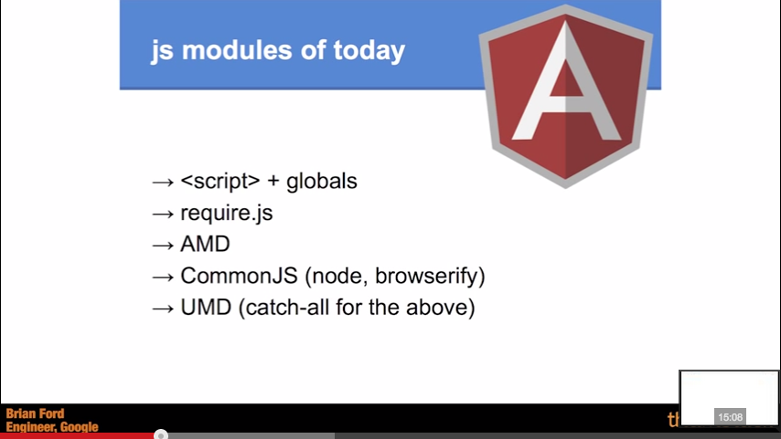
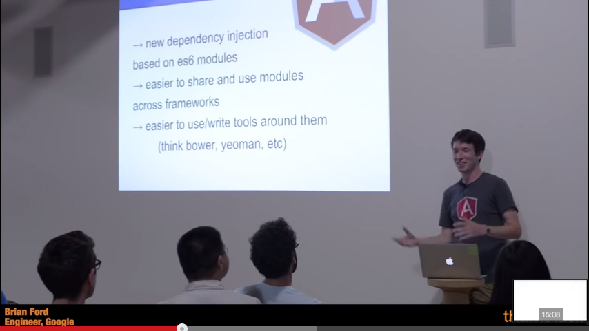
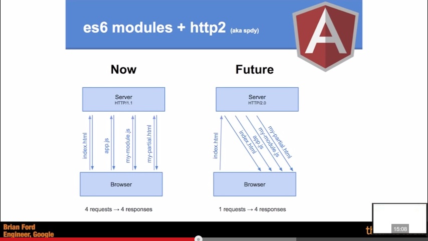
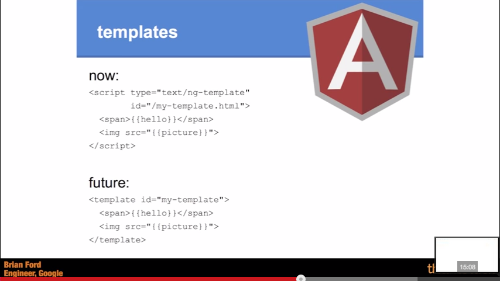
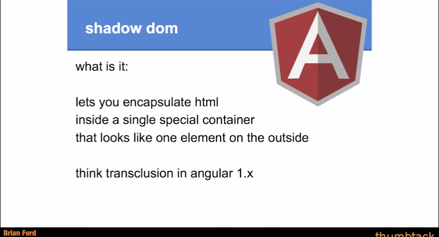
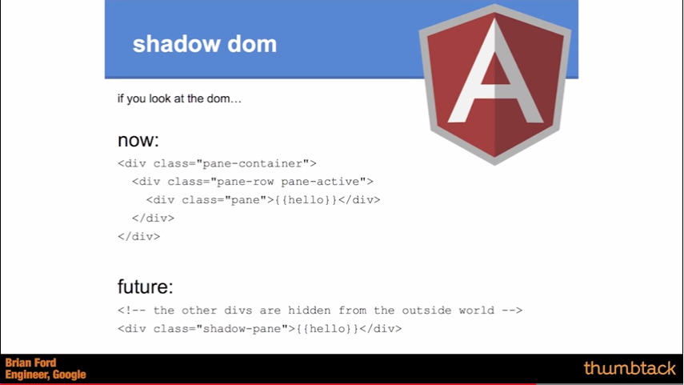
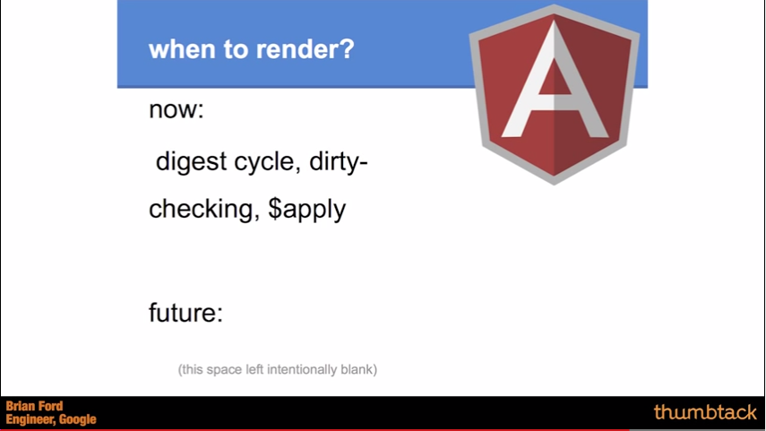

Brian Ford - The Future of AngularJS

[https://www.youtube.com/watch?v=XTPk_yYaqfQ](https://www.youtube.com/watch?v=XTPk_yYaqfQ)

  

  

Angular team hs impact on standards.

  

Angular can and is experimenting with new stuff, in contract of W3C.

Notion of modules could be outsourced from Angular.

  

Breaking Angular into separate components

  

Template – "DOM to be".

  

  

Native.observe will replace this.
