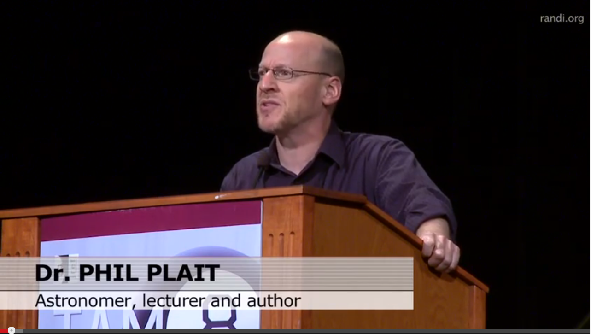

# Don't Be A Dick ~ Phil Plait

<http://www.youtube.com/watch?v=FrFRbGjUtJk>

  

Like breaking conventions.

Speak carefully to not be misinterpreted.

What it take to be **active scepticism**?

Rely on merits of arguments – evidence based reasoning.

How many of you no longer believe in something because somebody called you a stupid retard or similar insult? We become reasonable gradually.

Scepticism is hard.

How do you convince someone they are not thinking clearly, when they are not thinking clearly. How to reason somebody out of something if they weren't reasoned in in the first place.

Our brain is wired to faith. And if we loose faith, it is replaced by something similarly stupid.

Message we try to convey: no magic, no afterlife, no higher-moral father figure, no security, no happy-ever-after. This is a tough sell.

So people will rather prefer magic over science.

Generic person – scientist is boring.

With all of this against popularising of science, do not make it hard to deliver message of science.

What is the goal of the skeptical critical thinking movement?

* Quack medicine

* Remove of religion

Scientists – We experience love and joy, we just like the world the way it is.

Toolbox of critical thinking.

Persuading somebody - hammering a nail. You swing to much and you destroy the wall. It takes more good aimed swings.

We are communicating a message people do not want to hear – there's more of them and odds are agains us – way of communication is crucial.

Anger seeks a victim.

We do not need warriors, we need diplomats.

Always ask yourself, what your goal is. Is this going to help / or is it just to make me feel better.
