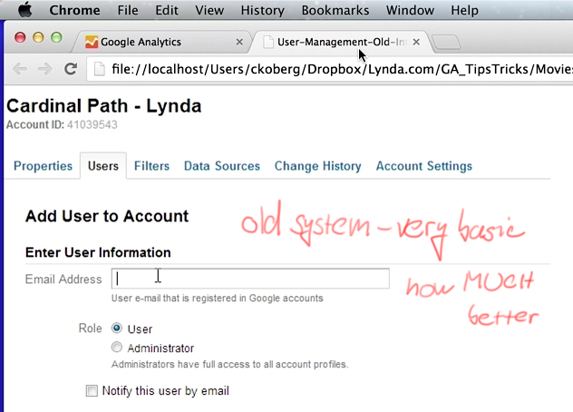
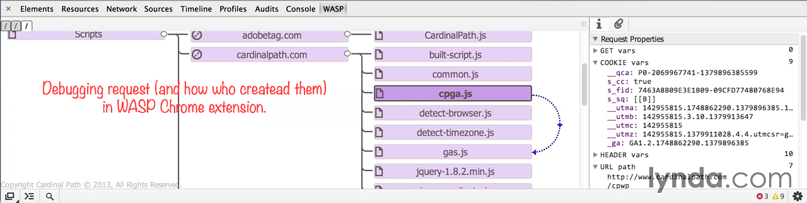
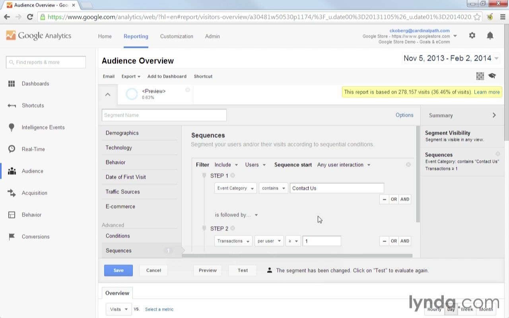
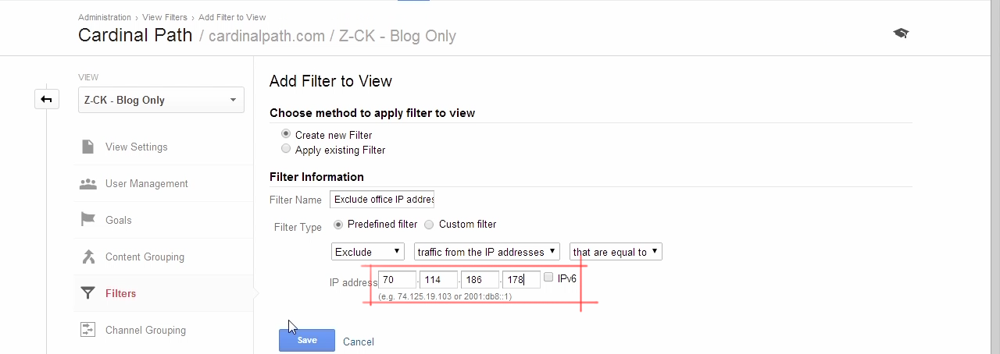
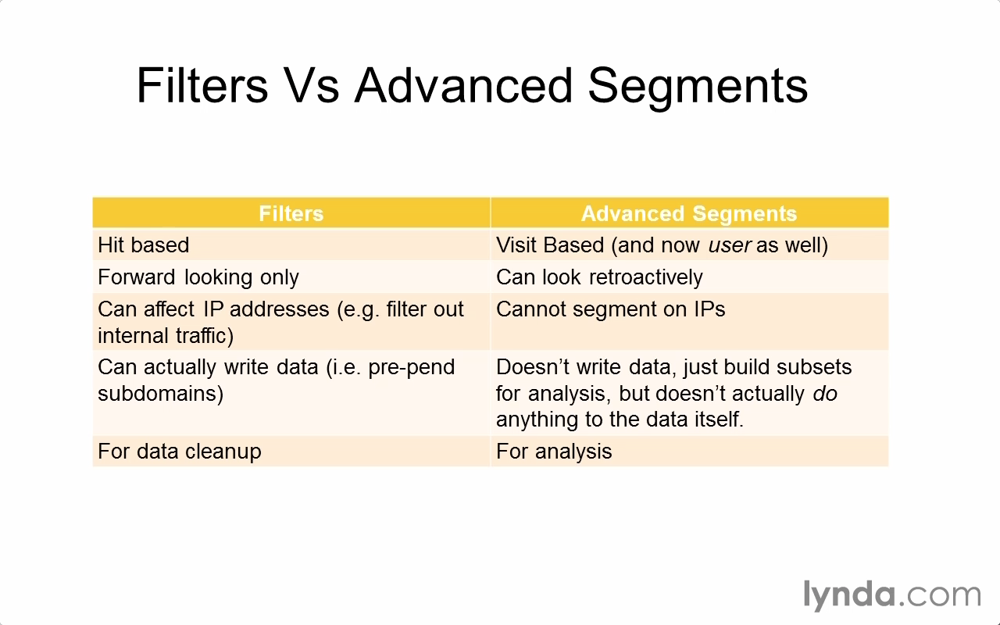
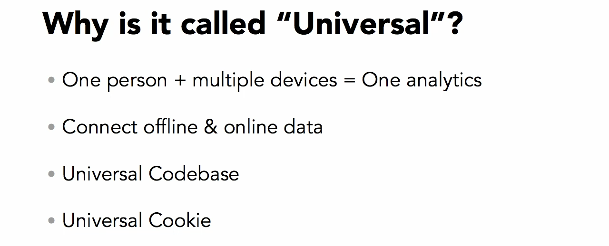
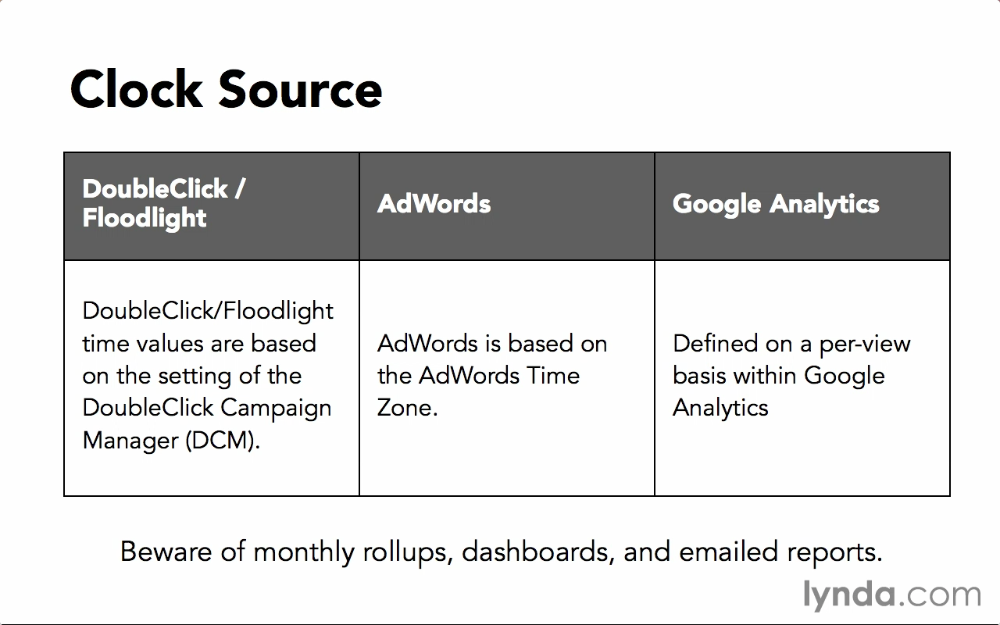

# Google Analytics Tips
http://www.lynda.com/Analytics-tutorials/Google-Analytics-Tips-Tricks-Tutorials/135364-2.html

  

  

Sampling is happening on property level. (Before it was in Views.) Views was called Profiles.

  

Reports are based on settings in views.

One google account can have more Google Analytics accounts, each GA account can have more properties.

User management – before it was just Admin and User. Was improved.

  

Permission are cascaded. Inherited permissions can be also increased in child nodes.

  

You can review all permission of a user.

  

  

  

  

<http://google.com/ads/preferences>  

<http://www.aboutads.info/choices/>  

***

Creating custom segments = useful eg. for branded and non-branded keywords for search origin.

If we are segmenting by `user` instead of visit, then one user is tracked for 90 days.

  

  

Cohort – group of people tied by common characteristics.

  

Filters – exclude office IP address.

  

  

Excluding blog with segment. - But beware, will exclude all whole visits, where user hits blog somewhere in the blog.

  

Custom filters  
* Include means **Include only**.
* Example: lowercasing UTM params to merge them in Analytics.

## Universal analytics

Support for retargeting. Next generation of GA.

One person can have more devices. User id override.

Other usage than websites, eg coffee machine.

  

  

Custom variables. – Eg. author of article, section.

*** 

Time zone

  

