# How Art Made the World
<http://www.pbs.org/howartmadetheworld/>

**Creative piece** – "You see what I want you to see." "See things the way I do.”

  

## Why care about art?

* **Images dominate our lives** (it inspire, manipulate, affect what we think of others and ourselves)
* **Art accompanies entire human evolution**
* **Different look** on the World when you understand Art
* **Universal story telling** (Transfer information without thinking and any language knowledge.)

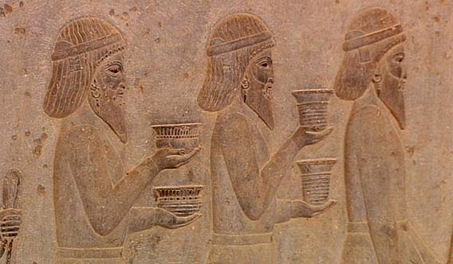  

---

## Non-reality

> The reality is we humans don't like reality. We want to be more human than human.

Majority of human body images don't resemble reality (and real human being.)

Our brain is hard-wired to focus upon parts of objects with *pleasing associations*.

We exaggerate parts that *mattered the most* (breast, hips, eyes, genitals) and ignore others completely (arms, legs, feet).

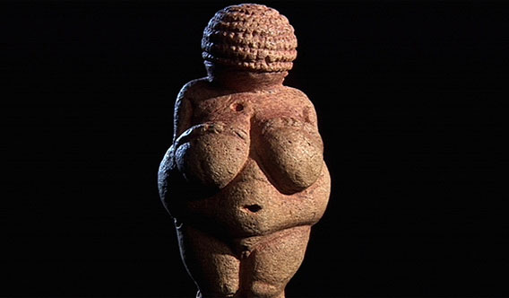

In some cultures this uberreality was **suppressed** (Egypt, early Greek), in others extremely **exaggerated** (Prehistoric).

**Impressionists** exaggerated light and colour rather than shape.

Even nowadays we are exaggerating those features we regard as attractive,

#### Seagull experiment

Seagulls chicks are stimulated by the sight of the red stripe on her beak.

> If seagulls had an art gallery, they would take this long thin stick, with the three red stripes, hang it on the wall, pay millions of dollars to purchase it, worship it, call it a Picasso.

> This would be a great work of art but they wouldn't understand why.

> They would say, "The damn thing doesn't resemble anything. Why am I mesmerized by it?"

## Egypt

Human bodies *lack exaggerated features*, they strive for neutral uniformity.

(The primeval instinct to exaggerate didn't survive to this era)

Complete lack the energy, movement, vigor.

Drawn using **rigid grid** – consistency through whole period of Egypt existence.

* **check** – front up, to emphasize V shape
* **face** – profile, but eyes from straight on
* **arms** – put together to show what they are doing
* **hands** – both palms outwards, all the fingers uniform length.
* **legs, feet** – sideways

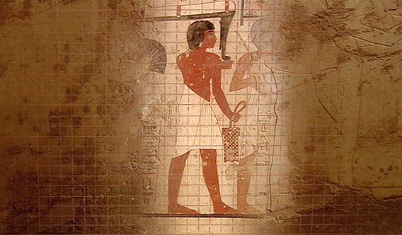  

## Greek

Men took an *obsessive shameless pride* in their physiques.

**Kritian Boy** – too realistic, that makes it boring.

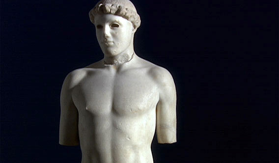  

### Polyclitus

Body *both relaxed and ready to move*, taken to extreme.

Divided the body, bent one knee and move its foot, bent one arm, rotated the chest. One side in motion, the other at rest.

* Extremely defined crest of muscle across the waist.
* Legs artificially long to match upper body.
* Deep groove in the middle of a body to exaggerate symmetry and body separation.
* Chest relaxed, back in motion.

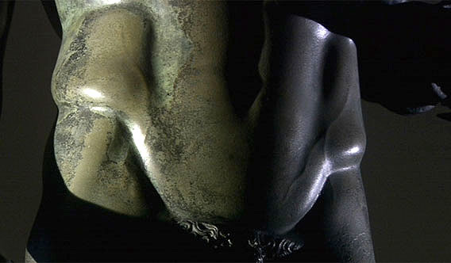  

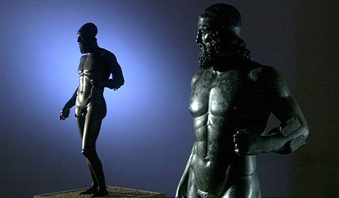  

Greeks were the first to depict emotions.

---

## Born of Art

Caves such as 8a71e5c5fabef680, Chauvet and Lascaux (roughly 35,000 BC). Almost exclusively images of animals, human bodies and abstract shapes. – **Creative explosion**

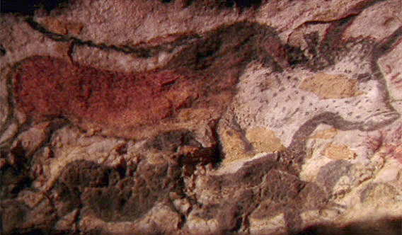  

Painting illustrated rituals to increase success of hunt.

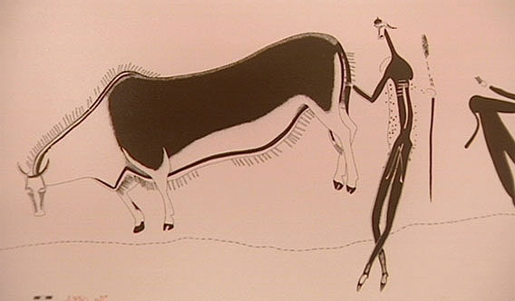

Paintings were results of visual hallucinations caused by rituals, trans state and complete lack of light (sensory deprivation) in caves.

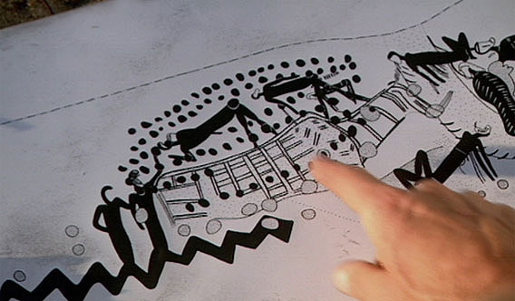

## Power of Art

Art is being exploited for its power since its creation.

Art was and is used to communicate power since Darius the Great of Persia. Illiteracy was predominant, art was only way to communicate with people, eg. with money.

Alexander the Great was depicted as fearless hero.

Art is heavily used for Politics and Persuasion.

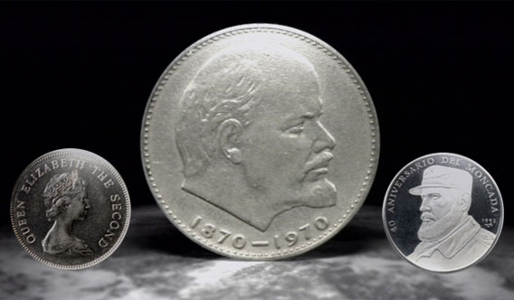

Politicians have had them depicted in a specific (and not always true) way to enforce political success.

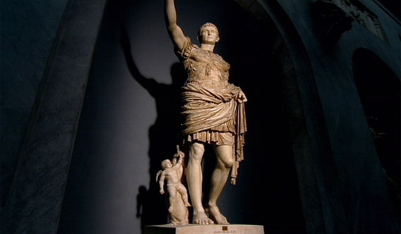

Art can lift you above your peers. Used since old pharaohs.

Art for personal adornment.

Human race has universal desire for a hero (which is defined by actions and events).

## Death and Art

Humans, however, are the only creatures that understand the inevitability of our own death.

Art was used to overcome fear of death. And to exploit fear of death.

Religion created terms of heaven and hell to enforce obedience. *– nice example of small choice paradigm*

Gilgamesh – search for eternal life.

Aztecs most cruel regime – killing spree.

Crucifixion of Jesus paradox – should terrify us, but it also reassure us.

---

#### Visual brain simulation experiment

Dark rook, closed eyes, bright lights directly into eyes -> hallucination.

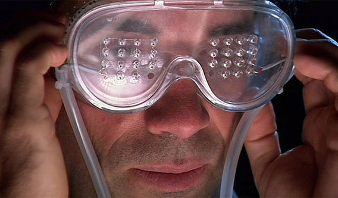  

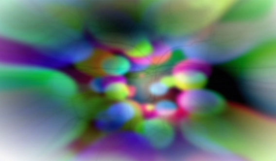  

#### Mortality experiment

Remind somebody of their mortality. They will be more radical in decisions.   

