# Lean Front-End Engineering
<http://frontendmasters.com/courses/lean-front-end-engineering/>

<https://twitter.com/billwscott>  

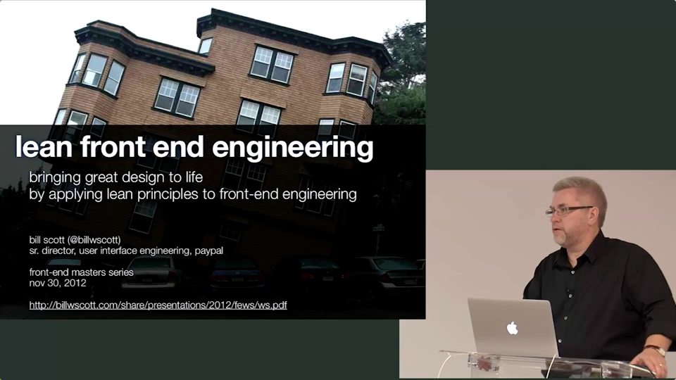  

No code, but how bring great experience to live.

Software engineers should care about UX, so their products can have huge impact.

You should get excited when it comes to UX of your app.

The Lean Startup by Eric Ries 
<http://www.amazon.com/The-Lean-Startup-Entrepreneurs-Continuous/dp/0307887898>

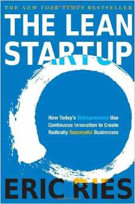  

Lean UX – lean startup concept applied to front-end engineering.

How you think about front-end as a craft of whole team.

History of game developer for old Macintosh, lead into design.

Being own manager – If you don’t have anybody to blame, you have to blame yourself.

PayPal overgrown itself and was failing to communicate inside. It become impossible to release something.

You get to known how good company is managed by calling to the call centre;

Best experience from screwed-up companies.

Product – design – engineering : walls between this processes in typical company.

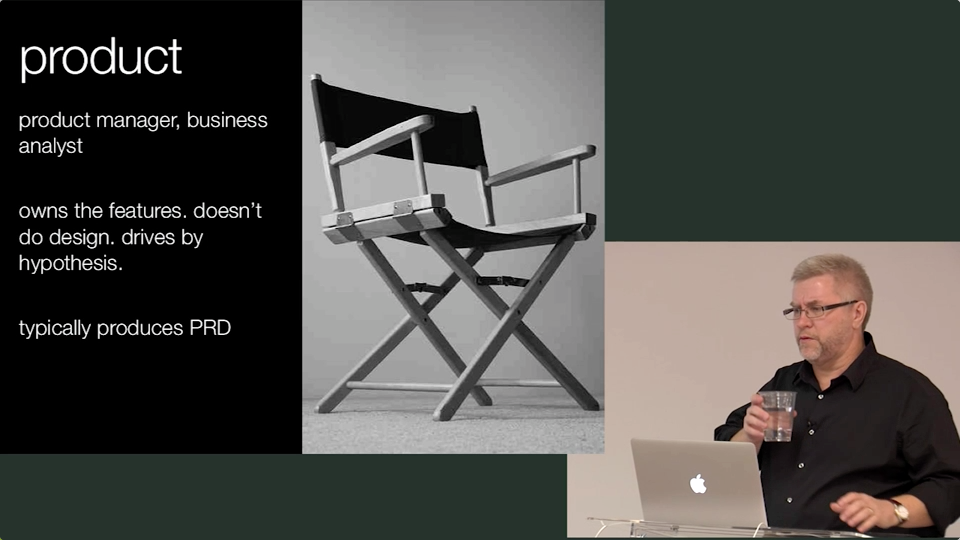  

PRD – Product Requirement Document, or just Spec :)

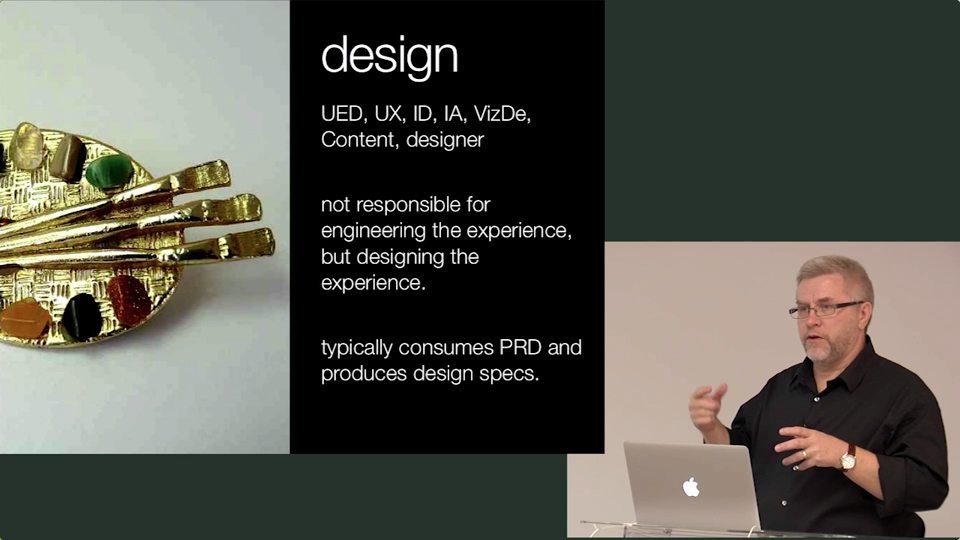  

DevDays

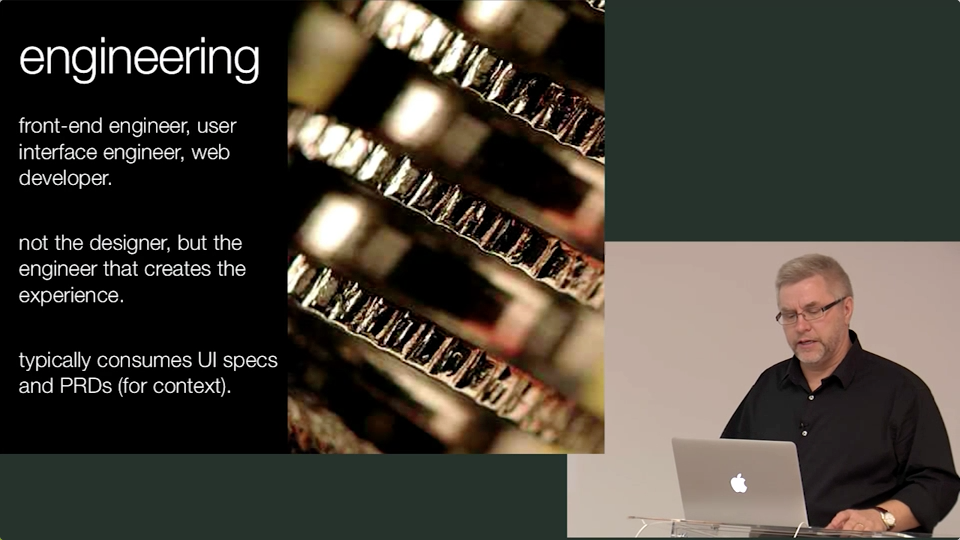  

Do not be a web monkey, be a designer of product.

You have to have experience in some field (engineering, design, …) to really understand it.

Designers would get alive without engineers.

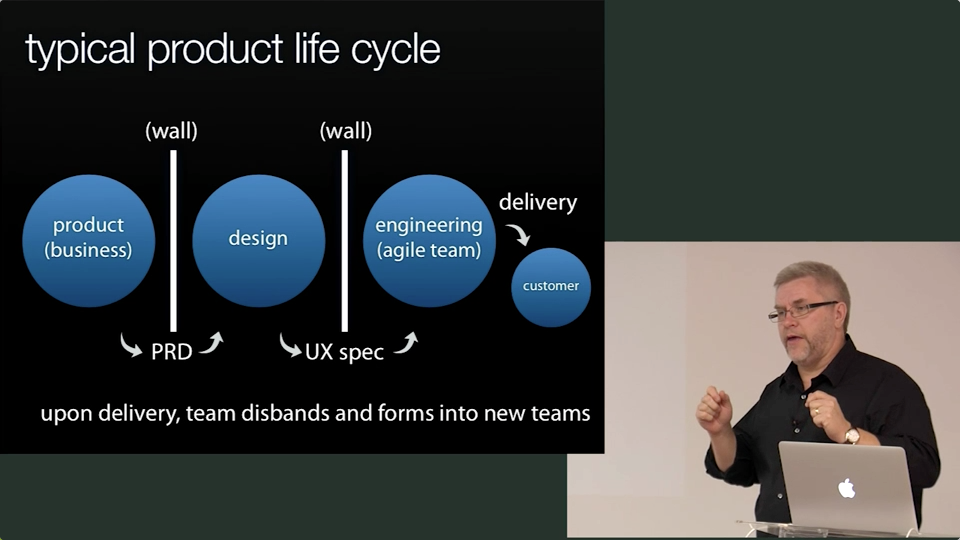  

Get it out live asap.

Fail fast / learn fast.

Don’t over think it.

Don’t create processes for processes sake.

Should company have employee handbook? No need if you got smart people.

Netflix sound like dream company to be employee in.

During development, you throw away crazy amount of code.

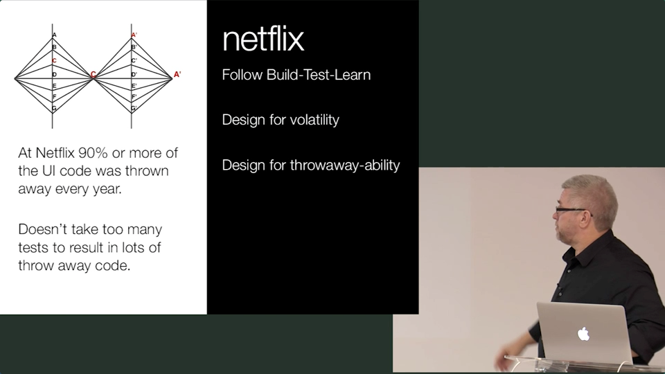  

Design for volatility – you can learn better.

How Buildings Learn: What Happens After They're Built
<http://www.amazon.com/How-Buildings-Learn-Happens-Theyre/dp/0140139966>

Use before reuse. Use is for users, reuse is for engineers.

Start with experience.

Do not introduce purposeless technology between developers and audience.

Lean manufacturing – shrinking batch sizes, just in time production, inventory control, acceleration of cycle times.

Kanban – very lightweight tracking workflow. You should learn from it.

There is always some information you don’t know and you still have to go to the battle.

Minimum viable product – do not try to create Big Bang.

Build – test – learn – repeat. Validate learning.

Know when to pivot, or persevere.

Release often by small batches.

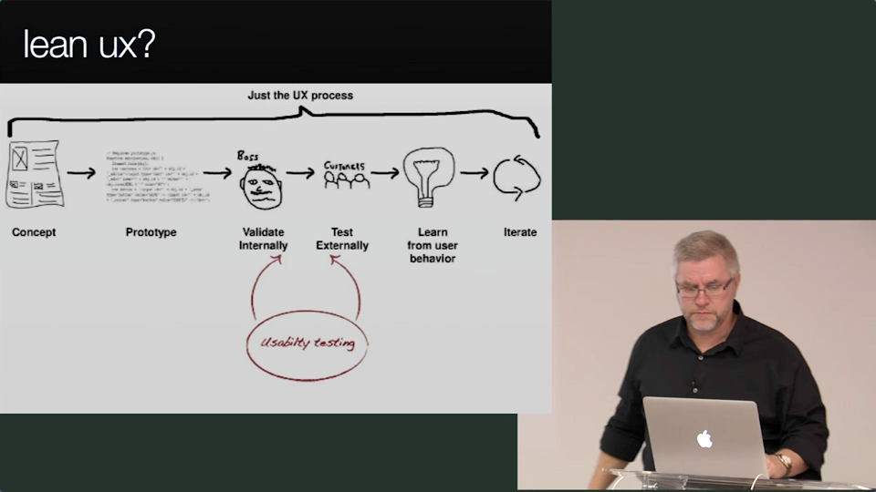  

Shared understanding.

Deep collaboration – trust, respect, 

Continuous customer feedback.

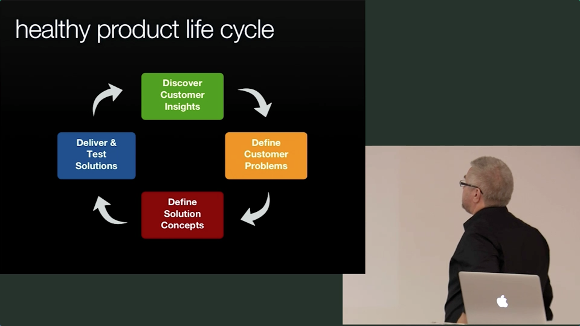  

Customers needs to have trust in our recommendations. Transparency builds trust.

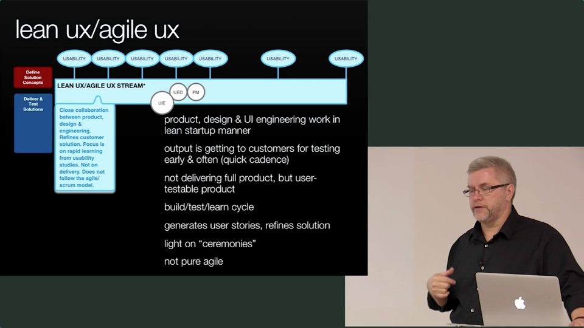  

Lean is not the same as agile.

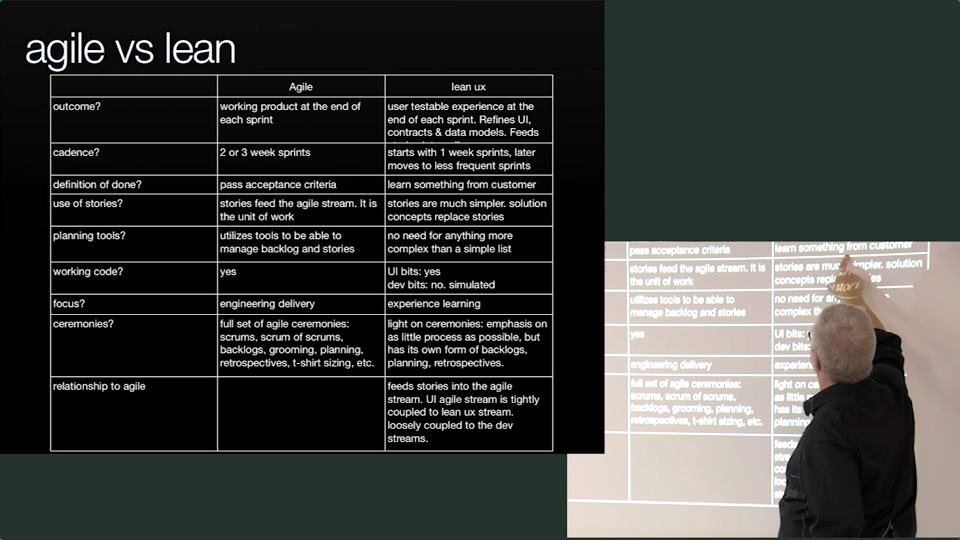  

War room at work.

Human are pretty weird, we don’t read, we are easily manipulated, …

Open sourcing internal stuff is good for discipline.

### Rapid prototyping

Axure, Balsamiq, InVision (collaborate with public)

### Javascript templating  

* doT.js <http://olado.github.io/doT/>
* linkedin/dustjs <https://github.com/linkedin/dustjs/>
* EJS <http://embeddedjs.com/>
* Handlebars.js <http://handlebarsjs.com/>
* Hogan.js <http://twitter.github.io/hogan.js/>
* visionmedia/jade <https://github.com/visionmedia/jade>
* janl/mustache.js <https://github.com/janl/mustache.js/>
* Underscore.js <http://documentcloud.github.io/underscore/#template>
* Freemarker has bad performance on big scale, needed to switched back to JSP.

***

Node is great for fast mock API.

Test on real devices early & often.

Time-tracking is extra baggage for programmers.

Client vs Server – it depends.

Do what make sense on client.

App vs page, on size doesn’t fit all.

#### Native vs web

All existing web technologies (analytics, a/b testing, delivery options) you have to reinvent.

PhoneGap, Cordova to bridge these two technologies.  

#### Lean UX Antipatterns

Do not work with genius designer.

Do not kill collaboration by separate tribes in team.

Do not underestimate properly train newcommers. fda fda Hello

Do not work with naysayers.

Be nice, but sincere.

Work isolate from time to time, but do not lose collaboration.

Have clear decision makers in each discipline (engineering, designers, …)

