Lukas Rubbelke & Matias Niemela - Awesome Interfaces with AngularJS Animations - NG-Conf 2014 

https://www.youtube.com/watch?v=hC0MpgUoui4

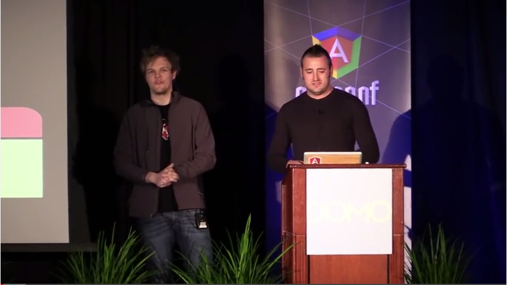  

All DOM manipulations in directives.

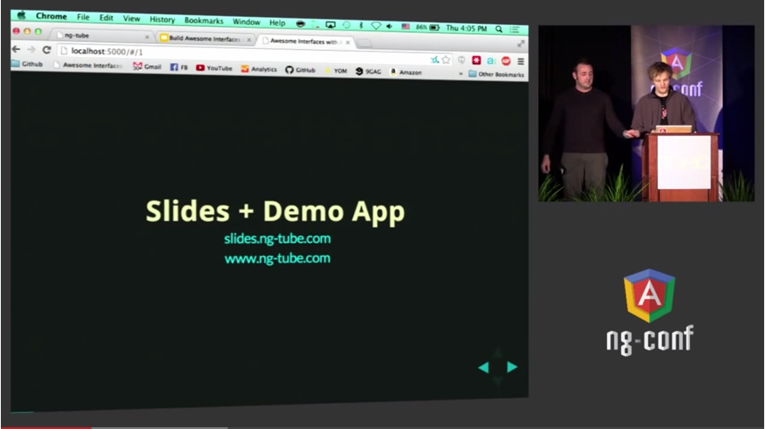  

Browsers are good at CSS animations.

Difficult CSS animations: sync, detect, isolate, organize.

Before anAnimate ngClass was best practice.

NgAnimate introduced in 1.1.4, remastered in 1.2 to own module.

Support transitions, keyframes, JS animations, ng directives are animations aware.

Include angular-animate.js

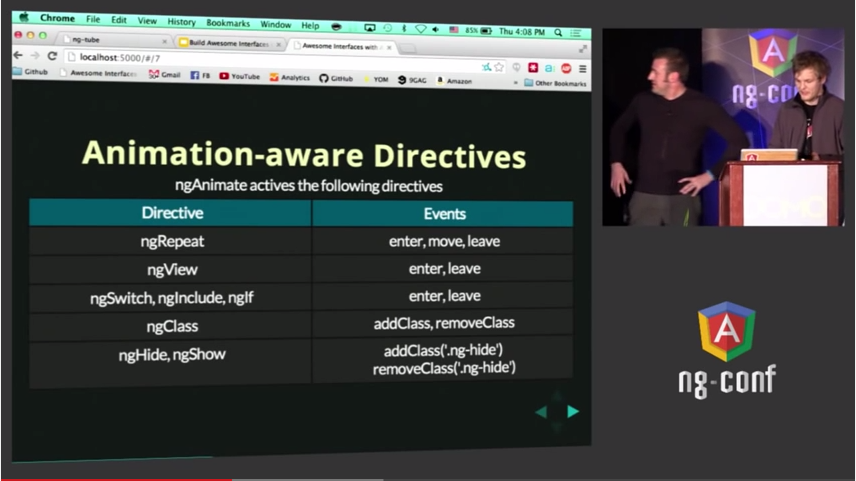  

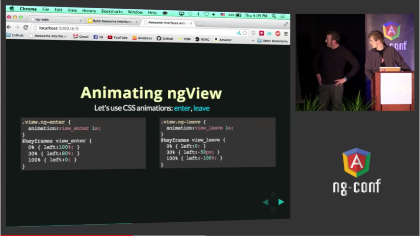  

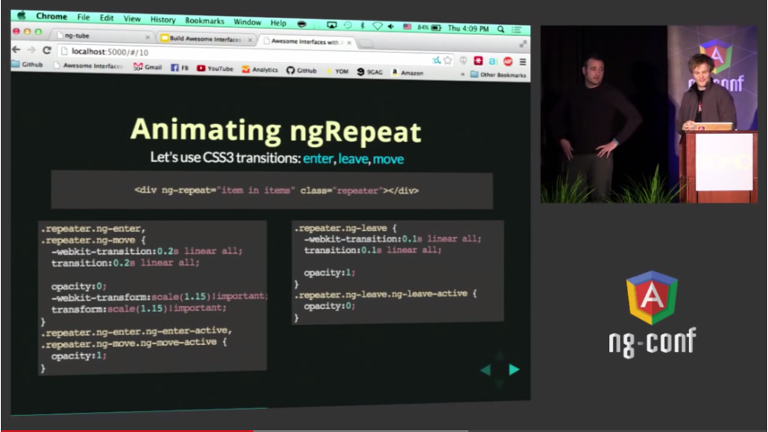  

We can use transitions instead of keyframes.

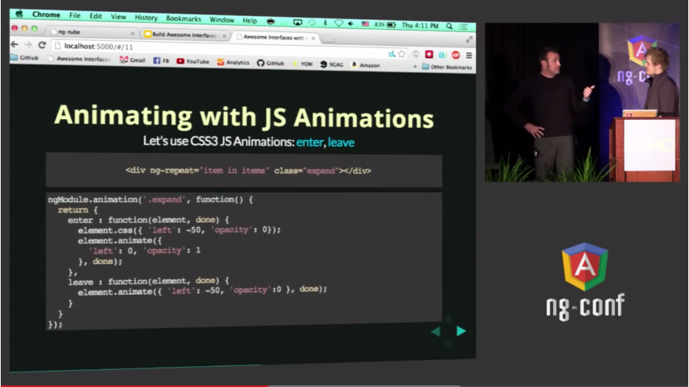  

Animations via JS: enter, leave.

Done is for closing animation.

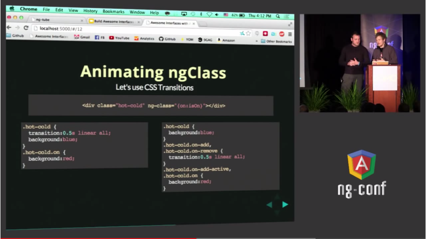  

Can be styled with css classes.

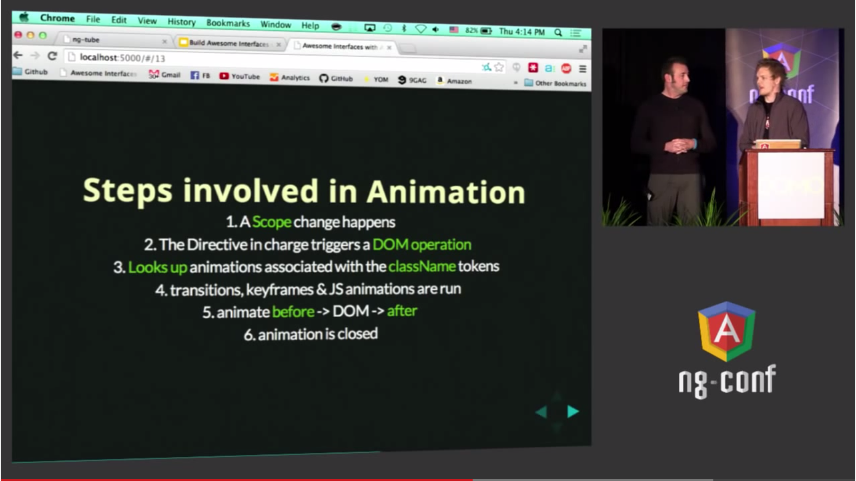  

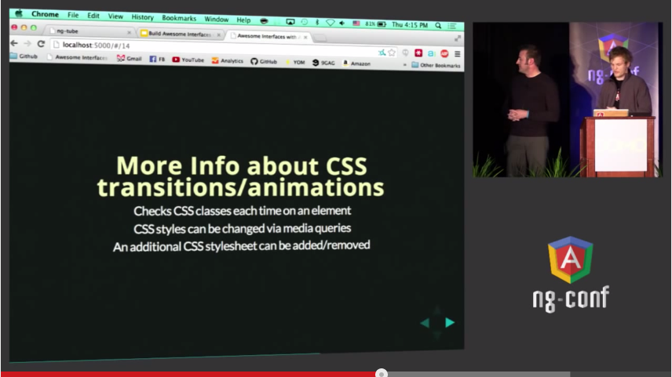  

No caching problems.

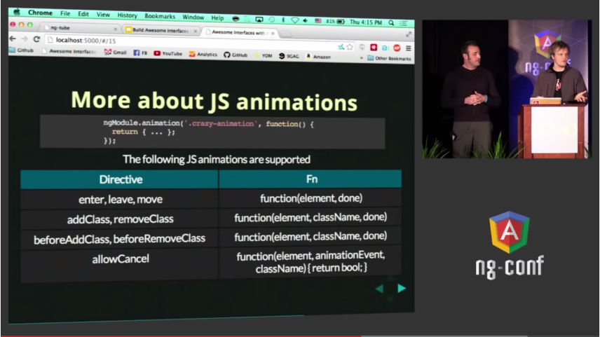  

$animate service.

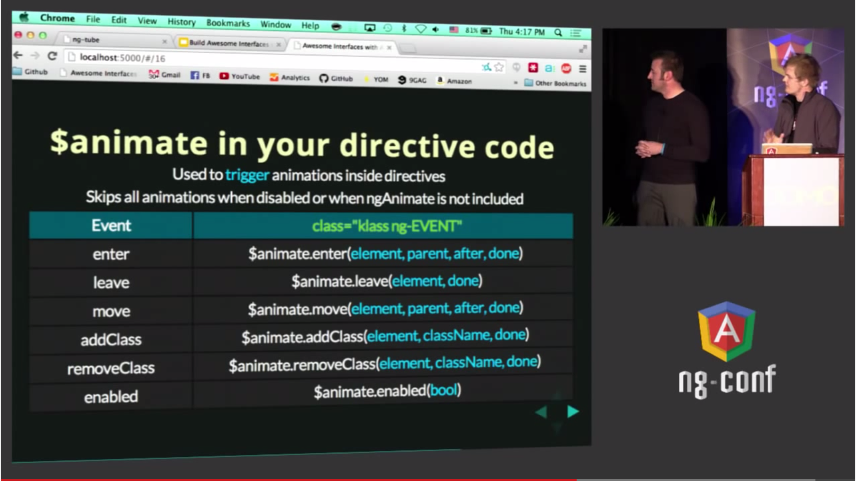  

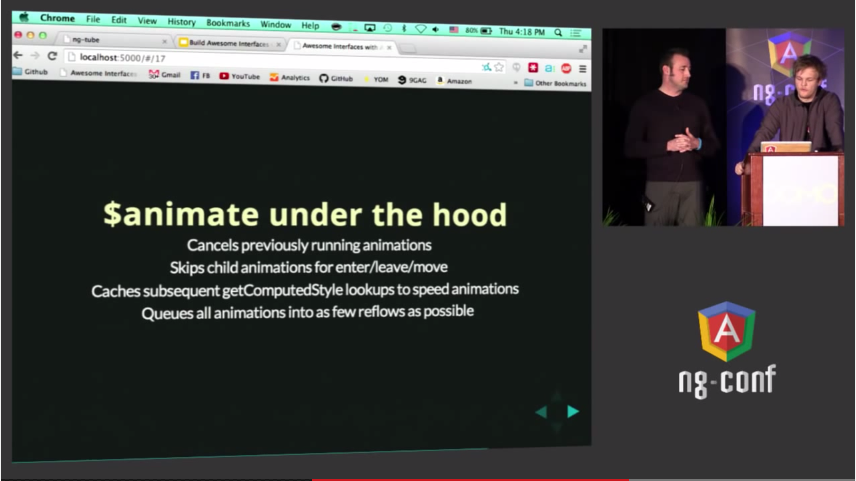  

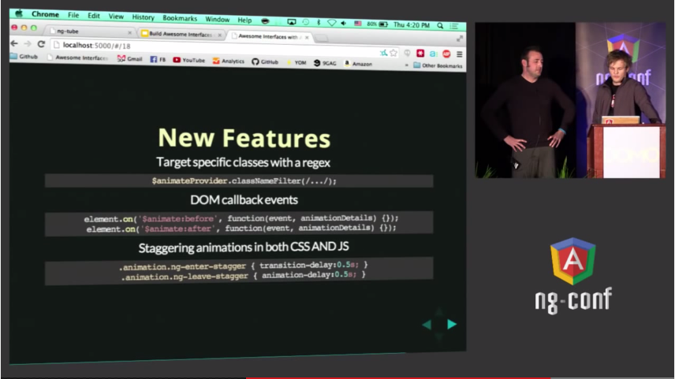  

Stagger - little delay between each item in ng-repeat

Future – Community will tell.
