Pascal Precht - i18n with angular-translate - Dutch AngularJS Meetup - YouTube 

[https://www.youtube.com/watch?v=9CWifOK_Wi8](https://www.youtube.com/watch?v=9CWifOK_Wi8)

  

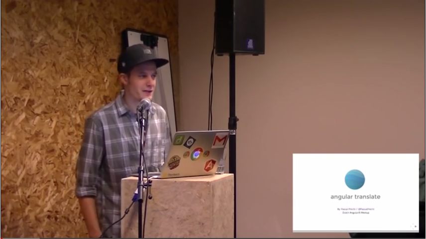  

  

[http://www.neoskop.de/](http://www.neoskop.de/)  

  

Angular Translate is module for i18n.

  

Different platforms, different languages to deploy.

  

Originally just filter function.

  

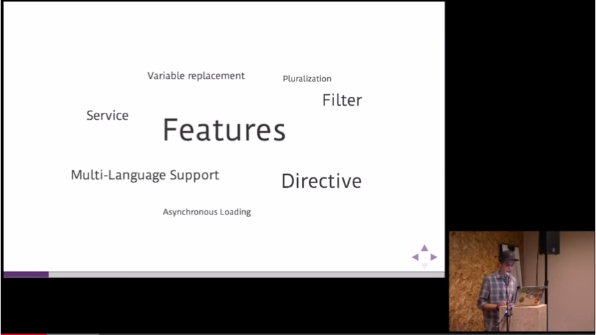  

  

Switching languages at runtime.

Lazy loading of translations.

Plularization – via MessageFormat (adaptor pattern)

  

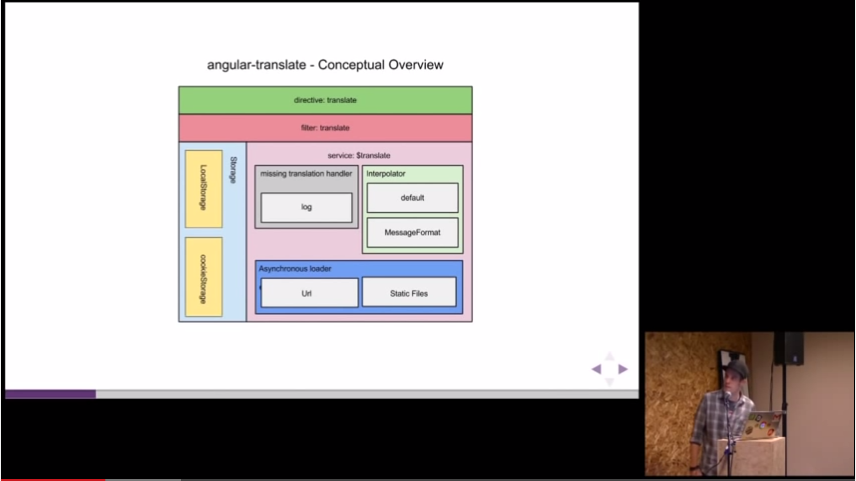  

  

React on missing translations via handler.

  

Core is kept as small as possible.

  

Url loader to define endpoint on server.

Static files – pattern how i18n data looks on your server.

  

Storage is not about storing translation data, it is about remembering chosen language.

  

  

Installation

* git

* bower install angular-translate

* download from webpage

  

#### $translateProvider

For configuration.

Every service has a provider, created behind the scenes.

Angular injector service needs provider for getting service.

You use provider to configure service.

Accessible only during config phrase.

Teaches your app languages.

Manages interpolation services (you can implement your own instead Angular’s own – for dynamic values in your translations strings – you have __n__ messages in your inbox)

  

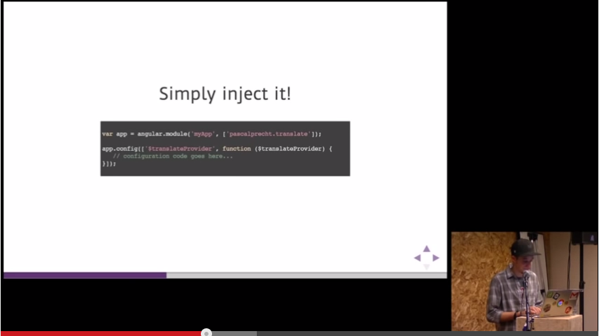  

  

  

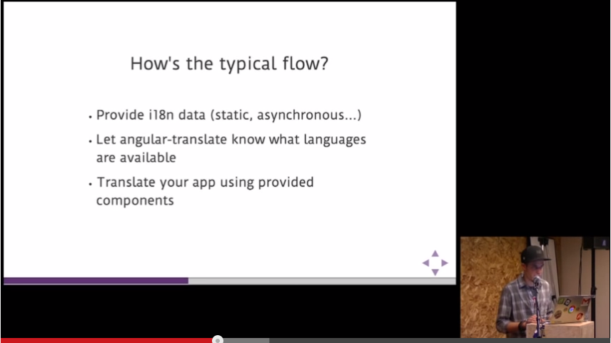

  

  

  

  

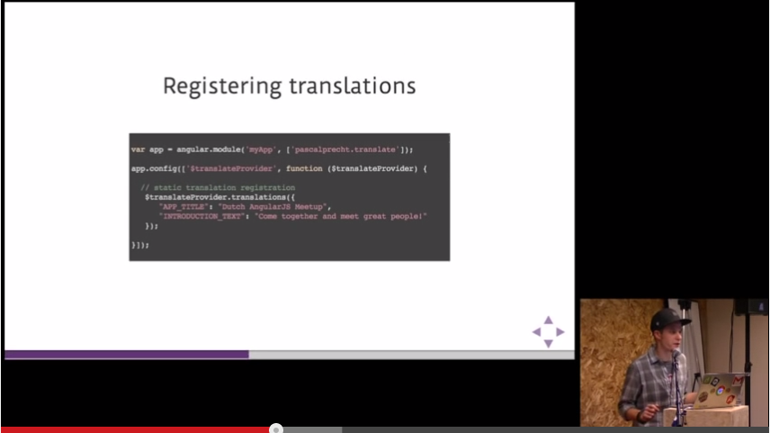  

  

  

Translations tables are plain JS hash objects.

  

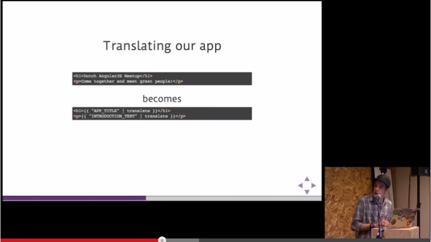  

  

  

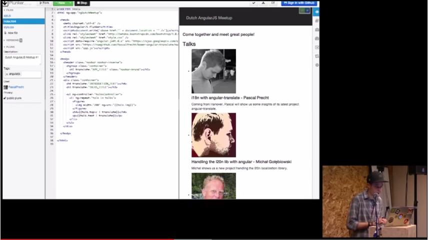  

  

  

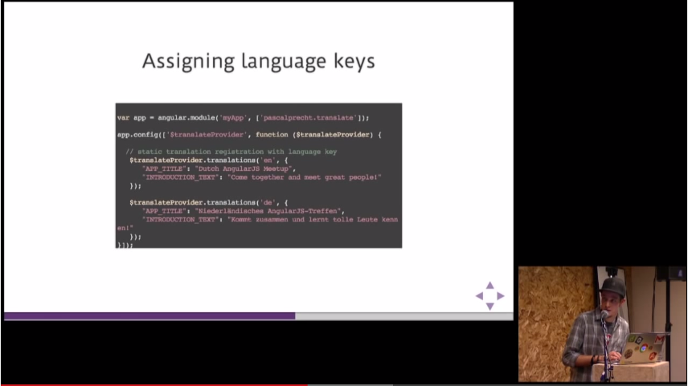

  

  

  

Asynchronous loading – do not bloat for config.

  

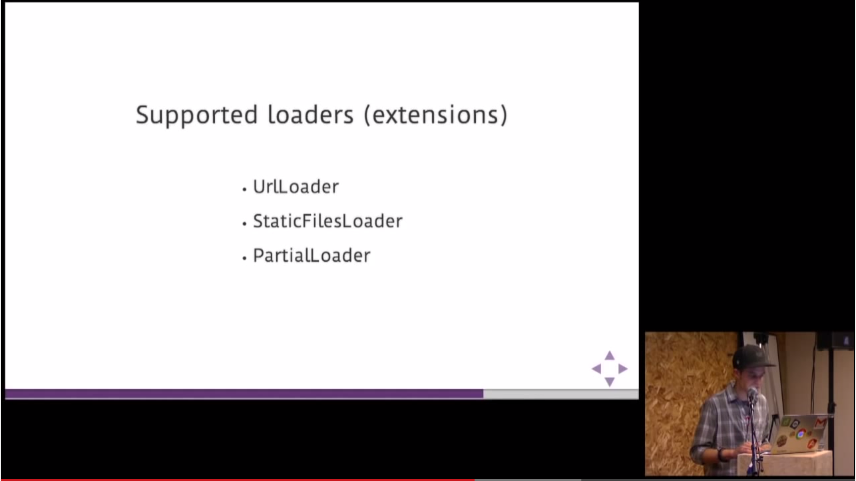  

  

StaticFilesLoader

bower install angular-translate-loader-static-files

  

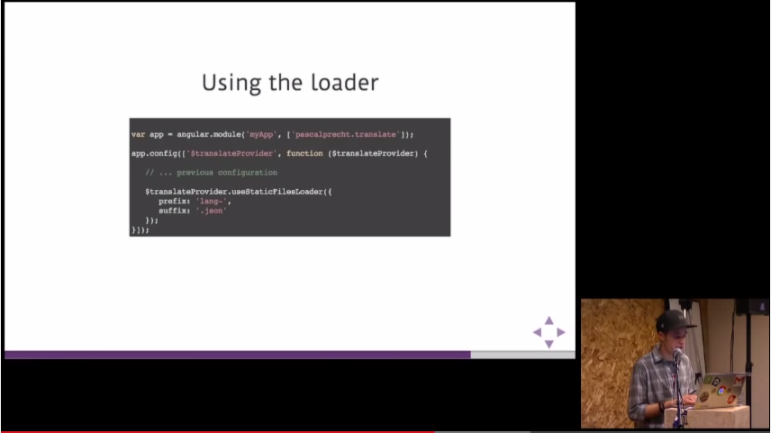  

  

  

  

