Realtime "Eye Candy" with AngularJS - YouTube 

[https://www.youtube.com/watch?v=8uj7YSqby7s](https://www.youtube.com/watch?v=8uj7YSqby7s)

  

  

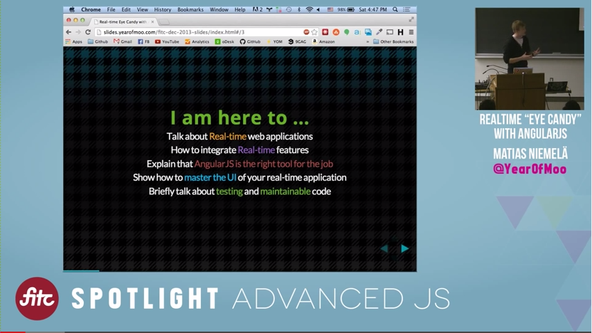  

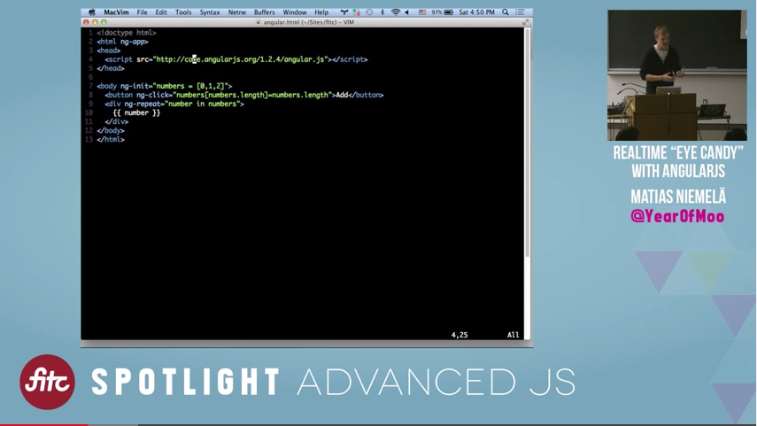

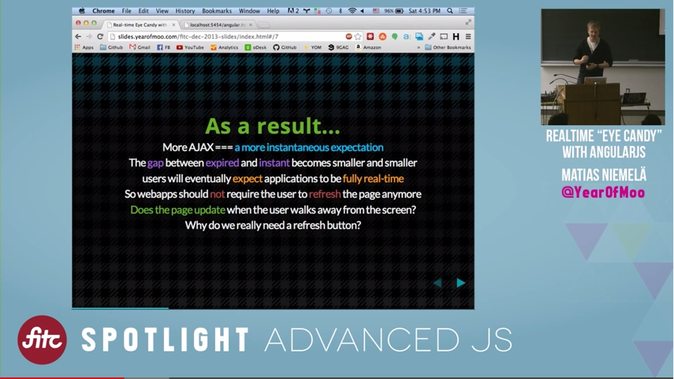

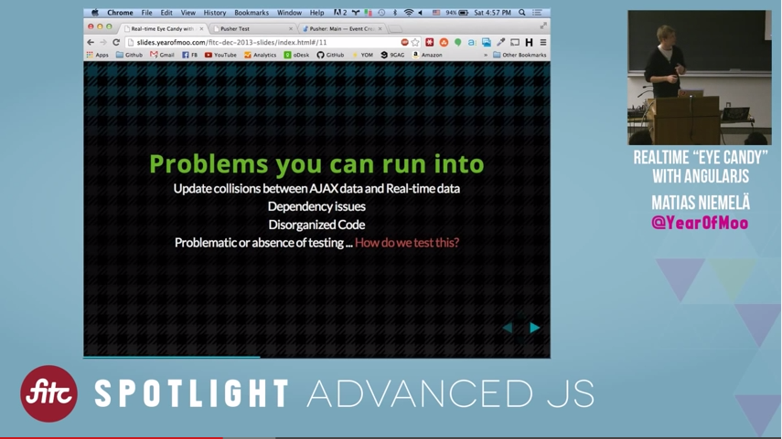

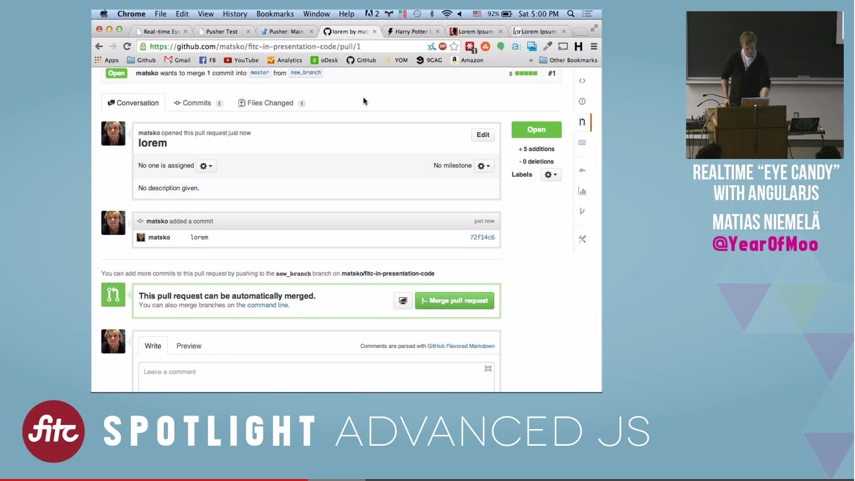

  

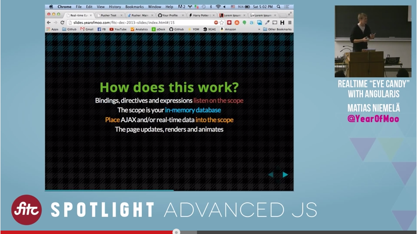  

Code can be a litte bit longer for small apps, but is very well structured, organized.

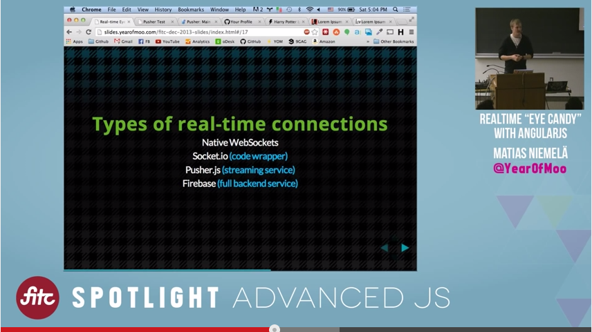  

Native WebSockets – IE10+  

Firebase – full backend system.

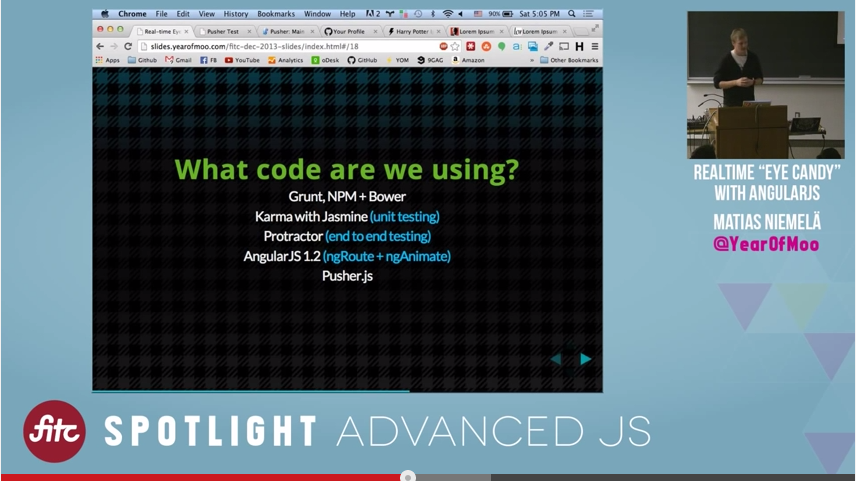  

We can use whatever we want for backed – the more decoupled, the better.

Animations are easy in Angular.

Realtime applications – update backend, frontend will update automatically.

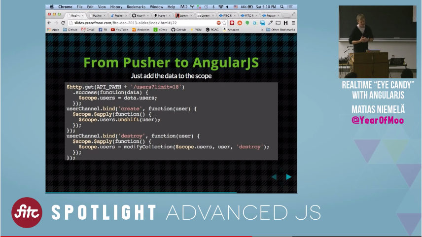  

First load data with simple AJAX request, then use sockets for simple additions or removal.

$scope.$apply – signal for telling Angular that data changed.

Angular-animate use transitions, keyframe animations and JS fallbacks

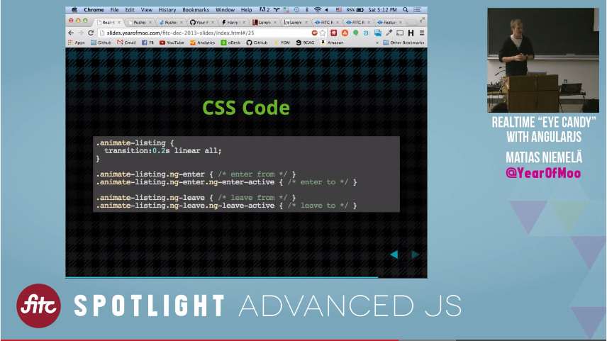  

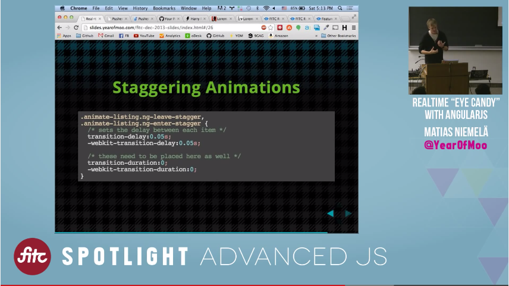

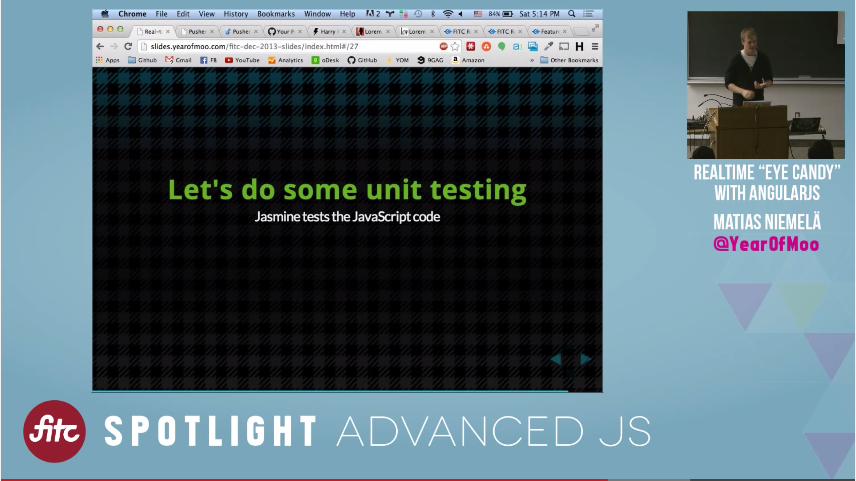  

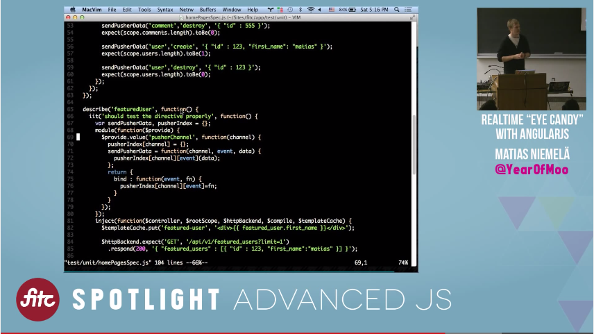

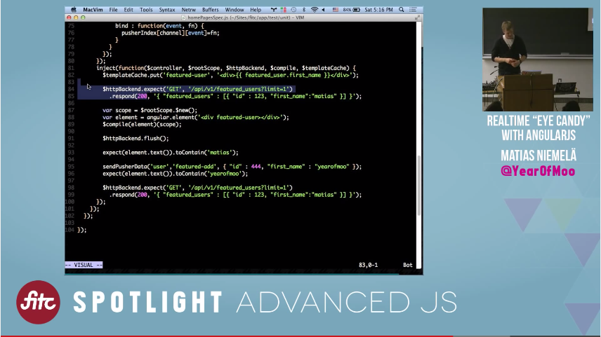

Unit testing is about code.

Integration testing is about application.

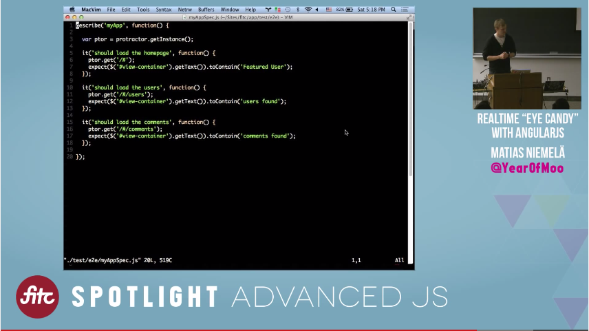  

Protractor works with Selenium – it runs server and clients can connect to it.

Realtime apps can change things unexpectedly – always have loading indicator, cloak the new data, if user is doing something, show prompt. But it’s new area, best practices not exists yet.

Protractor is not testing code or data, it is testing website – fixtures are complicated.

Use debugger; to freeze app during testing.

Animations on mobile are slow, but angular tries to be agnostic, uses best practices and wait until devices will catch up.

