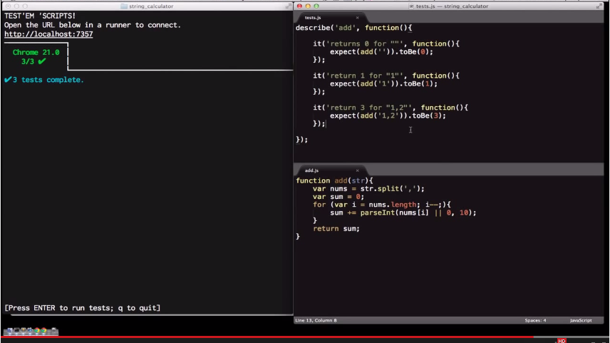
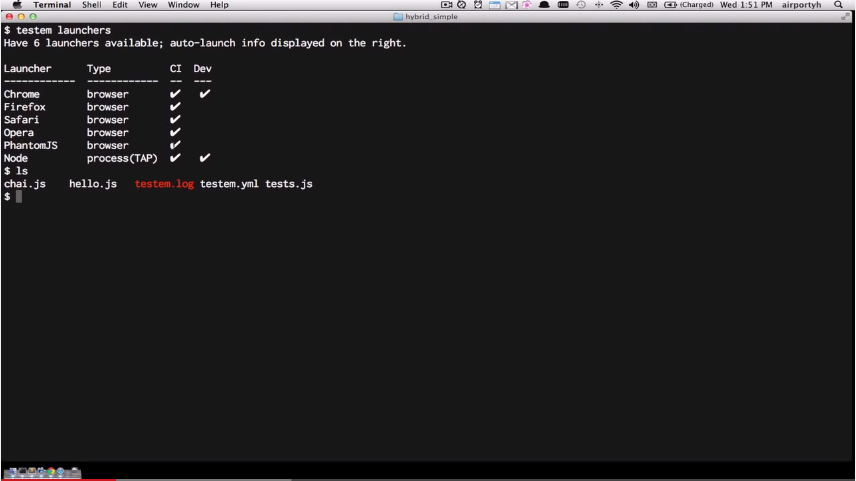

# Testem Intro (new) - YouTube

<https://www.youtube.com/watch?v=-1mjv4yk5JM>

**Development mode** – for TDD workflow.
**CI mode** - testing on Travis, BrowserStack, SauceLabs, ...

Example problem for this video: String calculator kata.

Connect browser to testem. `testem launchers` – browsers Testem knows about.

Autolaunch one of launchers via configuration file `testem.yml`

Split editor window workflow.

  

Console.log from code will appear in Testem console.

***

# Testem CI - YouTube

<https://www.youtube.com/watch?v=Js16Cj80HKY>

Test anything protocol – language agnostic – plugins for CI servers.