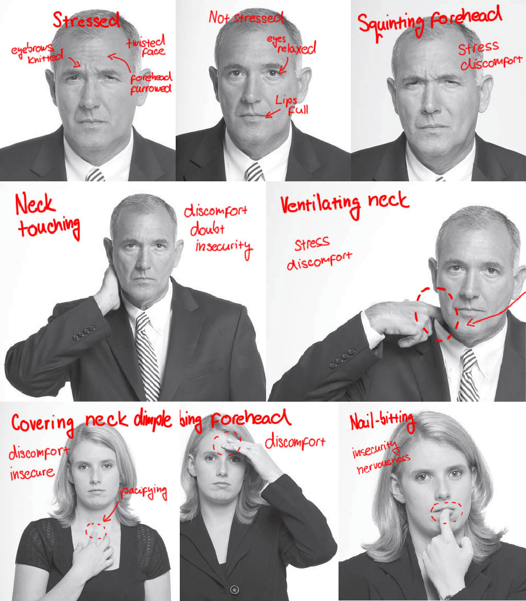
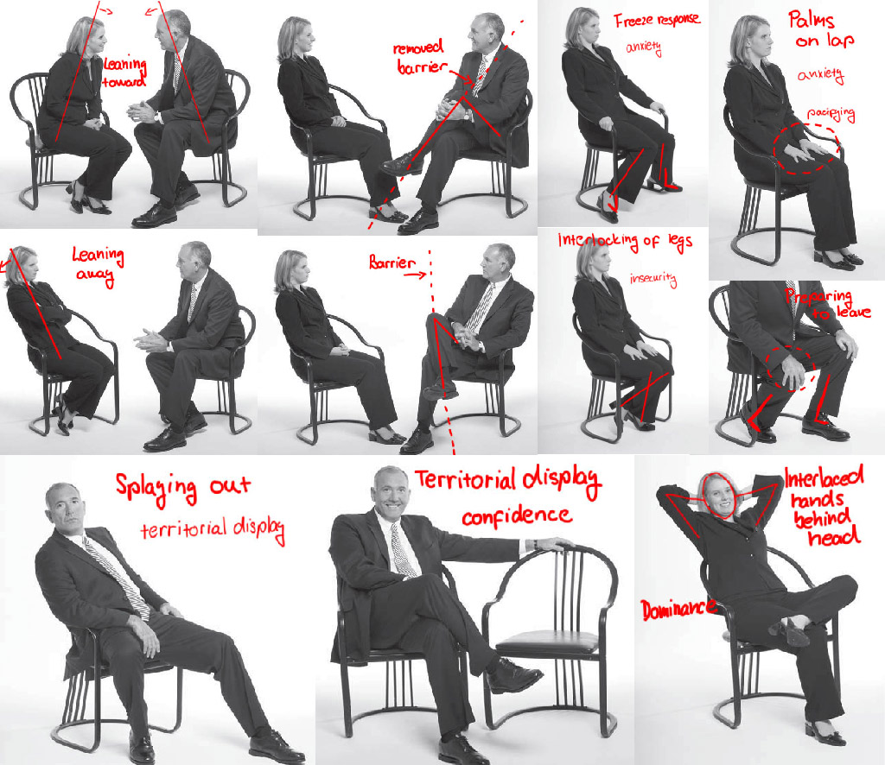
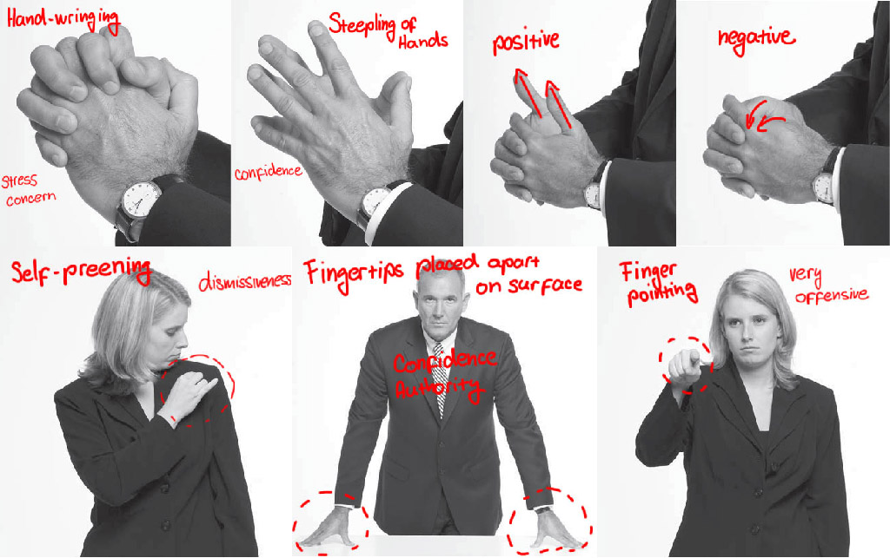

# BOOK: What Every BODY is Saying

***

## Review

Very lengthy and chatty.  
According to author, almost every subtle gesture mean something very important and dramatical.  
Author hasn't convinced me that he's real expert and not just former bad-guy-wannabe from FBI.  
Majority of content is not more than common sense.  
Supplement stories seem to been made-up by author, they are just too naive.  

## Notes

### Survival mechanism: *freeze, flight, fight*

#### The Freeze Response
Freezing your movement can often make you nearly *invisible to others*.  
Example: when being chastised, most people hold very still.  
Freeze behaviour when being *questioned about troubling matters.*  

**Historical purpose** of the freeze response:

* *avoid detection* by predators or in dangerous situations. 
* *opportunity to assess the situation* and determine the best course of action to take.

> Try using freeze response in important decision making.


#### The Flight Response
*Distance oneself from danger.*  
In modern world of cities adapted to modern needs: closing eyes, rubbing  eyes, or placing the hands in front of the face.

#### The Fight Response
* Turning fear into rage in order to fight off attackers.
* Arguing – fighting by nonphysical means.
* Insults, ad hominem phrases, counterallegations, denigration of professional stature, goading, and sarcasm.
* Civil lawsuits can even be construed as a modern and socially sanctioned type of fight or aggression.
* You can be very aggressive without physical contact, for example, just by using your posture, your eyes, …
* nonverbal behaviors can warn you when a person intends to harm you physically, giving you time to avoid a potential conflict.

### Unsorted notes



Ask intrusive questions:
```
If you had committed this crime, would you have used a gun?
If you had committed this crime, would you have used a knife?
If you had committed this crime, would you have used an ice pick?
If you had committed this crime, would you have used a hammer?
```

Watch gestures even when other is talking on the phone.

Watch for both presence and lack of gestures, or sudden change.

When trying to read people – *study, refine and apply*.

Better understanding of feelings, thoughts, and intentions can help you get along better with friends and family.

Nonverbal communication is a means of *transmitting information*.

Body language is often *more honest* than an individual’s verbal pronouncements.

Body language – true expressions of the emotion attached to the story.

Speaking is consciously crafted to *accomplish the speaker’s objectives*, not to be honest.

Whenever your observation of another person’s nonverbal behavior helps you understand that person’s feelings, intentions, or actions – or clarifies his or her spoken words — then you have successfully decoded and used this silent medium.

If you ever wondered why people still fly to meetings in the age of computers, text messages, e-mails, telephones, and video conferencing, it is because of the need to express and observe nonverbal communications in person.

**What to look after**: nervousness, stress, fear, anxiety, caution, boredom, restlessness, happiness, joy, hurt, shyness, coyness, humility, awkwardness, confidence, subservience, depression, lethargy, playfulness, sensuality, and anger

Utilize nonverbal behavior beyond the poker table.

Once you master the mechanics of using non-verbal communication effectively, it will become automatic and you can focus your full attention on decoding the world around you.

Concerted (effortful) observation is absolutely essential to reading people and detecting their nonverbal tells successfully.

You see, but you do not observe.

Ask them to go into a strange room filled with people, give them a chance to look around, and then tell them to close their eyes and report what they saw.

Becoming aware of the world around you is not a passive act. It requires constant practice to maintain. Exercise your observation muscle.

Learn to recognize and decode nonverbal behaviors that are universal.

When you interact with others, try to establish their **baseline behaviors** – how they typically sit, where they place their hands, the usual position of their feet, their posture and common facial expressions, the tilt of their heads, and even where they generally place or hold their possessions, such as a purse. You need to be able to differentiate between their “normal” face and their “stressed” face. *By examining what’s normal, we be- gin to recognize and identify what’s abnormal.*

Limbic behaviors are honest and reliable; they are true manifestations of our thoughts, feelings, and intentions. Because limbic part of our brain cannot be cognitively regulated.

Limbic brain has assured our survival as a species—and produced a reliable number of nonverbal tells in the process is by regulating our behavior when confronting danger.

### Pacifying behaviors (adapters)

Serve to calm us down after unpleasant experience. Don’t help us to solve problems; they help us to remain calm.

Examples:
thumb sucking, chewing gum, biting pencil, rubbing forehead, playing with jewelery, **sound** (exhaling, whistling, drumming fingers), **clothes** (adjusting, tie, ventilating), leg cleanser, self-hug

Knowing these can often lead to evincing information previously hidden that might give us new insights.

**Tip**: Ask about using Facebook in future embarrassment way, watch for change in behavior.

### Legs
* Your feet & legs are most honest part of your body.
* Face is the one part of the body that most often is used to bluff and conceal true sentiments. Start with legs.
* When it comes to honesty, truthfulness decreases as we move from the feet to the head.
* Society is telling us to hide, deceive, and lie with our faces for the sake of social harmony (Don't make that face, just look happy, …)
* Happy feet are one of the most honest ways our brains truthfully exclaim, “I am elated.”
* According to legs swivel after saying hello, you can tell if sb want to talk with you.
* Where feet points, there's where somebody wants to be.
* Excited → gravity-defying behaviours.
* Splay out legs wider - reestablish control of their situation and their territory.
* Territorial imperative - the more advantaged we are socioeconomically or hierarchically, the more territory we demand.
* Crossed legs when standing (resting one leg) - comfort, confidence, relaxing.
* Watch what is happening under the table.
* Try incidentally touching your friend under the table and watch reaction.
* Watch individual walking style
* Look for passengers who point their feet toward the exit while turning to the officer to make their customs declaration.
* Foot kicking or jiggling is normal, look for change in behaviour.
* Interlocked feet over a prolonged period is unnatural



### Torso
* Brain is trying to protect crucial and vital organs in torso.
* Torso is leaning away from stressful, unwanted things.
* Moving torso requires lot of energy, when happened it is not random and we can count on its honesty.
* People claim territory while on public transport.
* Our ventral (front) side is sensitive to things we like or dislike.
* Let others know that you agree with them -> lean toward or ventrally front them.
* Torso shield - use our arms or objects (buttoning jacket, placing backpacks, briefcases, pillow) to act as barriers
* Bowing at the waist is a sign of respect, humility, honour, regard to others.
* Clothes - where we fit in socially, economically, or occupationally.
* Splay out - disrespect for authority
* Puffing Up the Chest - establish territory dominance


### Arms
* Block bullets from gun with hands - brain knows it wouldn't help, but limbic brain is stronger
* Lowered arms protect torso from bumping into things
* Sinking arms when being down psychically
* When we are injured, threatened, abused, or worried, our arms come straight to our sides or they close across our chests or abdomen.
* arms freeze – the more he moves, the more likely he is to be noticed.
* Shoplifters tend to use less arm movements than regular customers.
* Arms behind back - higher status, do not want others near.
* Walking in couple, one's arms behind the back - restraining.
* Marking territory (armrests, table, desks in school, …) - territory is power.
* Arms akimbo - authoritative posture
* Hooding effect - dominance, power, confidence.
* Fingertips planted spread apart on a surface are a significant territorial display of confidence and authority.
* When we are confident we spread out, when we are less confident we withdraw.
* Man put his arm around his girlfriend in presence of other men.
* Arms relaxed, ventral side exposed, palms visible - greeting, putting others at ease
* Touch person on the arm to establish rapport
* The palms-up or “rogatory” position usually indicates the person wants to be believed or wants to be accepted. It is not a dominant, confident display.

### Fingers
* Our hands can execute very delicate movements, so they can reflect very subtle nuances within the brain
* Adolf Hitler is one of the best examples of how developing hand gestures improves his overall communication skills.
* You can practice your gestures in front of the mirror. Great speakers is doing this too.
* Hiding hands (underneath a table, behind your back) creates negative impression, suspicion, uncomfortable conversation.
* Showing your hands and palms is perceived as open, friendly.
* Handshake can be used to establish dominance. But there are better and more subtle ways – violation of space, eye-gaze.
* Some people insist on touching the inside side of your wrist during handshake. Most people feel uncomfortable with this.
* Politician handshake – cover handshake with the other hand.
* Finger pointing is viewed as very offensive, can be precursor to fight.
* Preening creates negative perception and is disrespectful. (Jay-Z: Dirt off Your Shoulder)
* Steepling of hands, fingertip to fingertip - confidence, power.
* Hand-wringing is a universal way of showing we are stressed or concerned.
* Carrying hands in pocket, thumbs sticking out – confidence.
* When individuals carry their thumbs high, it is a sign that they think highly of themselves and/or are confident in their thoughts or present circumstances
* Put thumbs in pocket and lets the fingers hang out on the side – low confidence, unsureness.
* Genital framing is a powerful dominance display. In essence, it is saying, “Check me out, I am a virile male.”
* Person’s arms become very restrained while telling a lie and otherwise are animated when telling the truth.
* Finger-to-palm stroking and rubbing of interlaced fingers are very very accurate indicator of high distress.
* Covering of a neck is universal indicator of threatening, objectionable, unsettling, questionable, or emotional subject.
* When the hands stop illustrating and emphasizing, it is usually a clue to a change in brain activ- ity (perhaps because of a lack of commitment) and is cause for heightened awareness and assessment.


